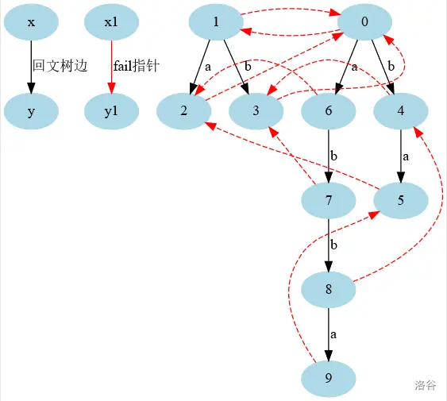
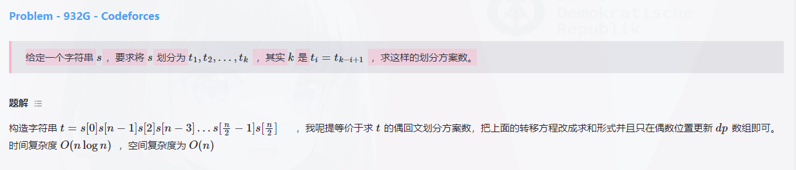
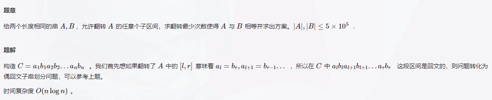

# YXHXianYu-XCPC-Template

## 0. 目录
- [YXHXianYu-XCPC-Template](#yxhxianyu-xcpc-template)
	- [0. 目录](#0-目录)
	- [1. 常用算法](#1-常用算法)
		- [1.1 对拍](#11-对拍)
		- [1.2 哈希表](#12-哈希表)
		- [1.3 fread快读](#13-fread快读)
	- [2. 计算几何](#2-计算几何)
		- [2.1 基础](#21-基础)
		- [2.2 极角排序](#22-极角排序)
		- [2.3 点与线段](#23-点与线段)
		- [2.4 多边形](#24-多边形)
			- [2.4.1 简单多边形面积](#241-简单多边形面积)
			- [2.4.2 点包含](#242-点包含)
			- [2.4.3 凸包](#243-凸包)
			- [2.4.4 不严格凸包](#244-不严格凸包)
			- [2.4.5 直线切凸多边形](#245-直线切凸多边形)
			- [2.4.6 旋转卡壳](#246-旋转卡壳)
			- [2.4.7 半平面交](#247-半平面交)
		- [2.5 圆](#25-圆)
			- [2.5.1 圆和圆的关系](#251-圆和圆的关系)
			- [2.5.2 圆和直线的交点](#252-圆和直线的交点)
			- [2.5.3 两个圆的交点](#253-两个圆的交点)
			- [2.5.4 两个圆的切线](#254-两个圆的切线)
			- [2.5.5 圆的内心、外心、垂心](#255-圆的内心外心垂心)
			- [2.5.6 最小圆覆盖](#256-最小圆覆盖)
			- [2.5.7 两个向量的夹角](#257-两个向量的夹角)
			- [2.5.8 求圆和三角形的交的有向面积](#258-求圆和三角形的交的有向面积)
			- [2.5.9 圆的面积并、欧拉公式](#259-圆的面积并欧拉公式)
		- [2.6 杂题](#26-杂题)
			- [2.6.1 平面最近点对](#261-平面最近点对)
			- [2.6.2 最小矩形覆盖](#262-最小矩形覆盖)
		- [2.7 三维计算几何](#27-三维计算几何)
	- [3. 字符串](#3-字符串)
		- [3.1 KMP](#31-kmp)
		- [3.2 EXKMP](#32-exkmp)
		- [3.3 Manacher](#33-manacher)
		- [3.4 AC自动机](#34-ac自动机)
		- [3.5 后缀数组 - 倍增 O(nlogn)](#35-后缀数组---倍增-onlogn)
		- [3.6 后缀数组 - SAIS O(n)](#36-后缀数组---sais-on)
		- [3.7 后缀自动机](#37-后缀自动机)
		- [3.8 广义后缀自动机](#38-广义后缀自动机)
		- [3.9 例题：SAM+线段树合并+树上倍增](#39-例题sam线段树合并树上倍增)
		- [3.10 最小表示法](#310-最小表示法)
		- [3.11 杂题](#311-杂题)
		- [3.12 回文自动机](#312-回文自动机)
			- [3.12.1 总览](#3121-总览)
			- [3.12.2 每个前缀的回文串个数](#3122-每个前缀的回文串个数)
			- [3.12.3 每个本质不同的回文串个数](#3123-每个本质不同的回文串个数)
			- [3.12.4 最小回文划分相关(无整理纯复制)](#3124-最小回文划分相关无整理纯复制)
			- [3.12.5 一个串的所有前缀的双回文子串个数](#3125-一个串的所有前缀的双回文子串个数)
	- [4. 数据结构](#4-数据结构)
		- [4.1 线性基](#41-线性基)
		- [4.2 雨天的尾巴：树链剖分+线段树合并+树上差分](#42-雨天的尾巴树链剖分线段树合并树上差分)
		- [4.3 线段树](#43-线段树)
		- [4.4 可持久化数组](#44-可持久化数组)
		- [4.5 静态区间第k小](#45-静态区间第k小)
		- [4.6 线段树优化建图](#46-线段树优化建图)
		- [4.7 线段树分裂](#47-线段树分裂)
	- [5. 图论](#5-图论)
		- [5.1 2-SAT](#51-2-sat)
		- [5.2 DFS序](#52-dfs序)
		- [5.3 欧拉序求LCA O(1)](#53-欧拉序求lca-o1)
		- [5.4 Tarjan求LCA](#54-tarjan求lca)
		- [5.5 虚树](#55-虚树)
		- [5.6 支配树](#56-支配树)
	- [6. 数论](#6-数论)
		- [6.1 逆元](#61-逆元)
		- [6.2 EXGCD](#62-exgcd)
		- [6.3 实数高斯消元](#63-实数高斯消元)
	- [9. 其他](#9-其他)
		- [9.1 树哈希](#91-树哈希)


* 缺：EXSAM、回文自动机、序列自动机

## 1. 常用算法

### 1.1 对拍

```c++
// 随机数生成（不保证环境均可用）
mt19937 rand(chrono::system_clock::now().time_since_epoch().count());
cout << rand() << endl;
// 对拍
while(true) {
	system("Edm.exe");
	system("Eac.exe");
	system("E.exe");
	if(system("fc E.out E.ans")) break;
}
```

### 1.2 哈希表

```c++
struct HASH { // 多测记得清空
	#define LLI long long // (maybe) int => signed (take care of SPACE Complexiy)
	const static int maxn = 2e5 + 10;
	const static int hashMaxn = 1 << 23;
	struct Edge {
		LLI a, b, v;
		int nxt;
	}e[maxn];
	int lst[hashMaxn], tot;
	int stk[maxn], top;
	
	void makeEdge(int h, LLI a, LLI b, LLI v) {
		e[++tot].a = a;
		e[tot].b = b;
		e[tot].v = v;
		e[tot].nxt = lst[h];
		lst[h] = tot;
		
		stk[++top] = h;
	}
	int getH(LLI a, LLI b) {
		return ((int)(13331ll * a + b) & (hashMaxn - 1));
	}
	void clear() {
		while(top) lst[stk[top]] = 0, top--;
        tot = 0;
	}
	void add(LLI a, LLI b, LLI v, bool ad) { 
		int h = getH(a, b);
		if(ad) {
			for(int i = lst[h]; i; i = e[i].nxt) {
				if(e[i].a == a && e[i].b == b) {
					e[i].v += v;
                    return;
				}
			}
		}
		makeEdge(h, a, b, v);
	}
	LLI query(LLI a, LLI b) {
		int h = getH(a, b);
		for(int i = lst[h]; i; i = e[i].nxt) {
			if(e[i].a == a && e[i].b == b) {
				return e[i].v;
			}
		}
		return 0;
	}
	#undef LLI
} mpn; // 多测记得清空
```

### 1.3 fread快读

```c++
static char buf[1000000],*p1=buf,*p2=buf,obuf[1000000],*p3=obuf;
#define getchar() p1==p2&&(p2=(p1=buf)+fread(buf,1,1000000,stdin),p1==p2)?EOF:*p1++
#define putchar(x) (p3-obuf<1000000)?(*p3++=x):(fwrite(obuf,p3-obuf,1,stdout),p3=obuf,*p3++=x)
template<typename item>
inline void read(item &x){
    x=0;int f=1;char c=getchar();
    while(c<'0'||c>'9'){if(c=='-')f=-1;c=getchar();}
    while(c>='0'&&c<='9')x=(x<<3)+(x<<1)+(c^48),c=getchar();
    x*=f;
}
template<typename item>
inline void uread(item &x){
    x=0;char c=getchar();
    while(c<'0'||c>'9')c=getchar();
    while(c>='0'&&c<='9')x=(x<<3)+(x<<1)+(c^48),c=getchar();
}
static char cc[20];
template<typename item>
inline void print(item x){ 
	int len=0;
	if(x<0)x=-x,putchar('-');
	while(x)cc[len++]=x%10+'0',x/=10;
	while(len--)putchar(cc[len]);
}
template<typename item>
inline void uprint(item x){ 
	int len=0;
	while(x)cc[len++]=x%10+'0',x/=10;
	while(len--)putchar(cc[len]);
}
```

## 2. 计算几何

> 本部分主要学习自杜老师的代码源计算几何课程～(∠・ω< )⌒★！

### 2.1 基础

```c++
typedef double db; // 换longdouble时，需要同时替换alpha函数和getTheta函数
const db EPS = 1e-9;

inline int sign(db a) { return a < -EPS ? -1 : a > EPS; }

inline int cmp(db a, db b) { return sign(a - b); }

// 点P
struct P {
    db x, y;
    P(): x(0), y(0) {}
    P(db _x, db _y): x(_x), y(_y) {}
    P operator+(P p) { return {x + p.x, y + p.y}; }
    P operator-(P p) { return {x - p.x, y - p.y}; }
    P operator*(db d) { return {x * d, y * d}; }
    P operator/(db d) { return {x / d, y / d}; }

    bool operator<(P p) const {
        int c = cmp(x, p.x);
        if(c) return c == -1;
        return cmp(y, p.y) == -1;
    }

    // 这里的比较可能不满足传递性，因为这是基于EPS的比较
    bool operator==(P p) const {
        return cmp(x, p.x) == 0 && cmp(y, p.y) == 0;
    }

    db dot(P p) { return x * p.x + y * p.y; }
    db det(P p) { return x * p.y - y * p.x; }
    // P cross(P p) { return {y*p.z - z*p.y, z*p.x - x*p.z, x*p.y - y*p.x}; }

    db distTo(P p) { return (*this-p).abs(); }
    // return value in [-pi, pi]; longdouble ver is atan2l(y, x)
    db alpha() { return atan2(y, x); }
    void read() { cin >> x >> y; }
    db abs() { return sqrt(abs2()); }
    db abs2() { return x * x + y * y; }
    P unit() { return *this / abs(); }
    P rot90() { return P(-y, x); }
    P rot(db an) { return {x*cos(an) - y*sin(an), x*sin(an) + y*cos(an)}; }
    int quad() const { return sign(y) == 1 || (sign(y) == 0 && sign(x) >= 0); }
};

#define cross(p1, p2, p3) ((p2.x-p1.x)*(p3.y-p1.y)-(p3.x-p1.x)*(p2.y-p1.y))
#define crossOp(p1, p2, p3) (sign(cross(p1, p2, p3)))
```

### 2.2 极角排序

```c++
// 待排序元素必须去除(0, 0)，否则结果会错误！
int n = 50;
vector<P> p(n + 1);
sort(p.begin() + 1, p.end() + n + 1, [&](P& a, P& b) {
    int qa = a.quad(), qb = b.quad();
    if(qa != qb) return qa < qb;
    else return sign(a.det(b)) > 0;
});
```

### 2.3 点与线段

```c++
// 判断 直线p1p2 和 直线q1q2 是否严格相交
// = crossOp(p1, p2, q1) * crossOp(p1, p2, q2) < 0

// 判断 直线p1p2 和 直线q1q2 是否相交
bool isLL(P p1, P p2, P q1, P q2) {
    db a1 = cross(q1, q2, p1), a2 = -cross(q1, q2, p2);
    return sign(a1 + a2) != 0;
}

// 求交点
P getLL(P p1, P p2, P q1, P q2) {
    db a1 = cross(q1, q2, p1), a2 = -cross(q1, q2, p2);
    return (p1 * a2 + p2 * a1) / (a1 + a2);
}

// 判断区间是否相交
bool intersect(db l1, db r1, db l2, db r2) {
    if(l1 > r1) swap(l1, r1); if(l2 > r2) swap(l2, r2);
    return !( cmp(r1, l2) == -1 || cmp(r2, l1) == -1 );
}

// 线段相交
bool isSS(P p1, P p2, P q1, P q2) {
    return intersect(p1.x, p2.x, q1.x, q2.x)
        && intersect(p1.y, p2.y, q1.y, q2.y)
        && crossOp(p1, p2, q1) * crossOp(p1, p2, q2) <= 0
        && crossOp(q1, q2, p1) * crossOp(q1, q2, p2) <= 0;
}

// 线段严格相交(不能交于端点)
bool isSS_strict(P p1, P p2, P q1, P q2) {
    return crossOp(p1, p2, q1) * crossOp(p1, p2, q2) < 0
        && crossOp(q1, q2, p1) * crossOp(q1, q2, p2) < 0;
}

// 点m 是否在 a 和 b 之间
bool isMiddle(db m, db a, db b) {
    if(a > b) swap(a, b);
    return cmp(a, m) <= 0 && cmp(m, b) <= 0;
}

// 点m 是否在 点a 和 点b 之间
bool isMiddle(P m, P a, P b) {
    return isMiddle(m.x, a.x, b.x) && isMiddle(m.y, a.y, b.y);
}

// 点q 是否在 直线p1p2 上
// => crossOp(p1, p2, q) == 0

// 点q 是否在 线段p1p2 上
bool onSeg(P p1, P p2, P q) {
    return crossOp(p1, p2, q) == 0 && isMiddle(q, p1, p2);
}

// 点q 是否在 线段p1p2 上(严格)
bool onSeg_strict(P p1, P p2, P q) {
    return crossOp(p1, p2, q) == 0 && sign((q-p1).dot(p1-p2)) * sign((q-p2).dot(p1-p2));
}

// 求 q 到 直线p1p2 的投影(垂足)
P proj(P p1, P p2, P q) {
    P dir = p2 - p1;
    return p1 + dir * (dir.dot(q - p1) / dir.abs2());
}

// 求 q 以 直线p1p2 为轴的反射
P reflect(P p1, P p2, P q) {
    return proj(p1, p2, q) * 2 - q;
}

// 求 q 到 线段p1p2 的最小距离
db nearest(P p1, P p2, P q) {
    if(p1 == p2) return p1.distTo(q);
    P v1 = p2 - p1, v2 = q - p1, v3 = q - p2;
    if(sign(v1.dot(v2)) == -1) return v2.abs();
    if(sign(v1.dot(v3)) == 1) return v3.abs();
    return fabs(v1.det(v2) / v1.abs());
    // if(p1 == p2) return p1.distTo(q); // TLE Version
    // P h = proj(p1, p2, q);
    // if(isMiddle(h, p1, p2)) return h.distTo(q);
    // return min(p1.distTo(q), p2.distTo(q));
}

// 求 线段p1p2 与 线段q1q2 的距离
db disSS(P p1, P p2, P q1, P q2) {
    if(isSS(p1, p2, q1, q2)) return 0;
    return min(
        min(nearest(p1, p2, q1), nearest(p1, p2, q2)),
        min(nearest(q1, q2, p1), nearest(q1, q2, p2))
    );
}
```

### 2.4 多边形

```c++
/* 重要约定，每个vector大小必须等于size+1，且index从1开始 */
/* 重要约定，逆时针为正方向 */
```

#### 2.4.1 简单多边形面积

```c++
// 求简单多边形面积（测过）
db area(vector<P>& ps) {
    int n = ps.size() - 1;
    db ret = 0;
    for(int i = 1; i <= n; i++) {
        ret += ps[i].det(ps[i % n + 1]);
    }
    return ret / 2;
}
```

#### 2.4.2 点包含

```c++
// 求点包含（测过）
// 2:inside, 1:on_seg, 0:outside
int contain(vector<P>& ps, P p) {
    int n = ps.size() - 1;
    int ret = 0;
    for(int i = 1; i <= n; i++) {
        P u = ps[i], v = ps[i % n + 1];
        if(onSeg(u, v, p)) return 1;
        if(cmp(u.y, v.y) <= 0) swap(u, v);
        if(cmp(p.y, u.y) > 0 || cmp(p.y, v.y) <= 0) continue;
        ret ^= crossOp(p, u, v) > 0;
    }
    return ret * 2;
}
```

#### 2.4.3 凸包

```c++
// 凸包（测过）
vector<P> convexHull(vector<P>& ps) {
    int n = ps.size() - 1;
    if(n <= 1) return ps;
    sort(ps.begin() + 1, ps.begin() + n + 1); // normal sort
    vector<P> qs(2 * n + 1);
    int cnt = 0;
    for(int i = 1; i <= n; qs[++cnt] = ps[i++]) {
        while(cnt > 1 && crossOp(qs[cnt - 1], qs[cnt], ps[i]) <= 0) cnt--;
    }
    for(int i = n - 1, t = cnt; i >= 1; qs[++cnt] = ps[i--]) {
        while(cnt > t && crossOp(qs[cnt - 1], qs[cnt], ps[i]) <= 0) cnt--;
    }
    qs.resize(cnt); // 去除了最后一个重复的点
    return qs;
}
```

#### 2.4.4 不严格凸包

```c++
// 不严格凸包(考虑共线)
// 使用前必须对点进行去重
vector<P> convexHullNonStrict(vector<P>& ps) {
    int n = ps.size() - 1;
    if(n <= 1) return ps;
    sort(ps.begin() + 1, ps.begin() + n + 1); // normal sort
    vector<P> qs(2 * n + 1);
    int cnt = 0;
    for(int i = 1; i <= n; qs[++cnt] = ps[i++]) {
        while(cnt > 1 && crossOp(qs[cnt - 1], qs[cnt], ps[i]) < 0) cnt--;
    }
    for(int i = n - 1, t = cnt; i >= 1; qs[++cnt] = ps[i--]) {
        while(cnt > t && crossOp(qs[cnt - 1], qs[cnt], ps[i]) < 0) cnt--;
    }
    qs.resize(cnt); // 去除了最后一个重复的点
    return qs;
}
```

#### 2.4.5 直线切凸多边形

```c++
// 直线切凸多边形（测过）
// convexCut是用 直线cut出直线的左半边（即叉积为正的点集）
// 所以 convexCut(r, p[i], p[i] o (p[1 - i] - p[i]).rot90());
// 若 o 为 +，则表示 p[1 - i] 到 p[i] 的外侧（不包含 p[1 - i] 的区域）；
// 若 o 为 -，则表示 p[1 - i] 到 p[i] 的内测（包含 p[1 - i] 的区域）；
vector<P> convexCut(const vector<P>& ps, P q1, P q2) {
    vector<P> qs(1);
    int n = ps.size() - 1;
    for(int i = 1; i <= n; i++) {
        P p1 = ps[i], p2 = ps[i % n + 1];
        int d1 = crossOp(q1, q2, p1), d2 = crossOp(q1, q2, p2);
        if(d1 >= 0) qs.push_back(p1);
        if(d1 * d2 < 0) qs.push_back(getLL(p1, p2, q1, q2));
    }
    return qs;
}
```

#### 2.4.6 旋转卡壳

```c++
// 旋转卡壳（输入必须是一个凸包）
db convexDiameter(vector<P>& ps) {
    int n = ps.size() - 1; if(n <= 1) return 0;
    int is = 1, js = 1;
    for(int k = 2; k <= n; k++) {
        is = ps[k] < ps[is] ? k : is;
        js = ps[js] < ps[k] ? k : js;
    }
    int i = is, j = js;
    db ret = ps[i].distTo(ps[j]);
    do {
        if((ps[i % n + 1] - ps[i]).det(ps[j % n + 1] - ps[j]) >= 0)
            j = j % n + 1;
        else
            i = i % n + 1;
        ret = max(ret, ps[i].distTo(ps[j]));
    } while(i != is || j != js);
    return ret;
}
```

#### 2.4.7 半平面交

```c++
// 半平面交
db halfPlane(vector<pair<P, P>>& a) {
    int n = a.size() - 1;
    auto compare = [](pair<P, P>& a, pair<P, P>& b) {
        P va = a.second - a.first;
        P vb = b.second - b.first;
        int qa = va.quad();
        int qb = vb.quad();
        if(qa != qb) return qa < qb;
        int v = sign(va.det(vb));
        return v == -1;
    };
    sort(a.begin() + 1, a.begin() + n + 1, [](pair<P, P>& a, pair<P, P>& b) {
        P va = a.second - a.first;
        P vb = b.second - b.first;
        int qa = va.quad();
        int qb = vb.quad();
        if(qa != qb) return qa < qb;
        int v = sign(va.det(vb));
        if(v != 0) return v == -1;
        return crossOp(a.first, a.second, b.second) < 0;
    });
    auto right = [](pair<P,P>& a, pair<P,P>& b, pair<P,P>& c) {
        P p = getLL(b.first, b.second, c.first, c.second);
        return crossOp(a.first, a.second, p) <= 0;
    };
    vector<pair<P, P>> q(n + 1);
    int h = 1, t = 1;
    q[1] = a[1];
    for(int i = 2; i <= n; i++) {
        if(compare(a[i], a[i-1])) continue;
        while(h < t && right(a[i], q[t], q[t-1])) t--;
        while(h < t && right(a[i], q[h], q[h+1])) h++;
        q[++t] = a[i];
    }
    while(h < t && right(q[h], q[t], q[t-1])) t--;

    if(h == t) return 0.0;

    vector<P> ans(1);
    for(int i = h, j = 1; i < t; i++, j++) {
        ans.push_back(getLL(q[i].first, q[i].second, q[i+1].first, q[i+1].second));
        P cp = getLL(q[i].first, q[i].second, q[i+1].first, q[i+1].second);
    }
    ans.push_back(getLL(q[t].first, q[t].second, q[h].first, q[h].second));

    return fabs(area(ans));
    // return ans;
}
```

### 2.5 圆

#### 2.5.1 圆和圆的关系

```c++
// 判断两个圆之间的关系
int circleIntersect(P o1, db r1, P o2, db r2) {
    db d = o1.distTo(o2);
    if(cmp(d, r1 + r2) == 1) return 4;      // 相离
    if(cmp(d, r1 + r2) == 0) return 3;      // 外切
    if(cmp(d, abs(r1 - r2)) == 1) return 2; // 相交
    if(cmp(d, abs(r1 - r2)) == 0) return 1; // 内切
    return 0;                               // 内含
}
```

#### 2.5.2 圆和直线的交点

```c++
// 获取圆和直线的交点
vector<P> getCL(P o, db r, P p1, P p2) {
	if (cmp(abs((o-p1).det(p2-p1)/p1.distTo(p2)),r)>0) return {};
	db x = (p1-o).dot(p2-p1), y = (p2-p1).abs2(), d = x * x - y * ((p1-o).abs2() - r*r);
	d = max(d,(db)0.0); P m = p1 - (p2-p1)*(x/y), dr = (p2-p1)*(sqrt(d)/y);
	return {m-dr,m+dr}; //along dir: p1->p2
}
```

#### 2.5.3 两个圆的交点

```c++
// 获取两个圆的交点
// need to check whether two circles are the same
vector<P> getCC(P o1, db r1, P o2, db r2) {
	db d = o1.distTo(o2); 
	if (cmp(d, r1 + r2) == 1) return {};
	if (cmp(d,abs(r1-r2))==-1) return {};
	d = min(d, r1 + r2);
	db y = (r1 * r1 + d * d - r2 * r2) / (2 * d), x = sqrt(r1 * r1 - y * y);
	P dr = (o2 - o1).unit();
	P q1 = o1 + dr * y, q2 = dr.rot90() * x;
	return {q1-q2,q1+q2}; // along circle 1
}
```

#### 2.5.4 两个圆的切线

```c++
// 求两个圆的切线
// extanCC(r2>0); intanCC(r2<0); tanCP(r2=0)
vector<pair<P, P>> tanCC(P o1, db r1, P o2, db r2) {
	P d = o2 - o1;
	db dr = r1 - r2, d2 = d.abs2(), h2 = d2 - dr * dr;
	if (sign(d2) == 0|| sign(h2) < 0) return {};
	h2 = max((db)0.0, h2);
	vector<pair<P, P>> ret;
	for (db sign : {-1, 1}) {
		P v = (d * dr + d.rot90() * sqrt(h2) * sign) / d2;
		ret.push_back({o1 + v * r1, o2 + v * r2});
	}
	if (sign(h2) == 0) ret.pop_back();
	return ret;
}
```

#### 2.5.5 圆的内心、外心、垂心

```c++
// 求三角形内心
P inCenter(P A, P B, P C) {
	double a = (B - C).abs(), b = (C - A).abs(), c = (A - B).abs();
	return (A * a + B * b + C * c) / (a + b + c);
}

// 求三角形外心
P circumCenter(P a, P b, P c) {
	P bb = b - a, cc = c - a;
	double db = bb.abs2(), dc = cc.abs2(), d = 2 * bb.det(cc);
	return a - P(bb.y * dc - cc.y * db, cc.x * db - bb.x * dc) / d;
}

// 求三角形垂心
P othroCenter(P a, P b, P c) {
	P ba = b - a, ca = c - a, bc = b - c;
	double Y = ba.y * ca.y * bc.y,
	A = ca.x * ba.y - ba.x * ca.y,
	x0 = (Y + ca.x * ba.y * b.x - ba.x * ca.y * c.x) / A,
	y0 = -ba.x * (x0 - c.x) / ba.y + ca.y;
	return {x0, y0};
}
```

#### 2.5.6 最小圆覆盖

```c++
// 最小圆覆盖
pair<P, db> min_circle(vector<P>& ps) {
    random_shuffle(ps.begin(), ps.end());
    int n = ps.size() - 1;
    P o = ps[0]; db r = 0;
    for(int i = 2; i <= n; i++) if(o.distTo(ps[i]) > r + EPS) {
        o = ps[i]; r = 0;
        for(int j = 1; j < i; j++) if(o.distTo(ps[j]) > r + EPS) {
            o = (ps[i] + ps[j]) / 2; r = o.distTo(ps[i]);
            for(int k = 1; k < j; k++) if(o.distTo(ps[k]) > r + EPS) {
                o = circumCenter(ps[i], ps[j], ps[k]);
                r = o.distTo(ps[i]);
            }
        }
    }
    return {o, r};
}
```

#### 2.5.7 两个向量的夹角

```c++
// 求两个向量的夹角
db getTheta(P p1, P p2) {
    return atan2(p1.det(p2), p1.dot(p2));
}
```

#### 2.5.8 求圆和三角形的交的有向面积

```c++
// 求圆和三角形的交的有向面积
// 如果要求圆和简单多边形的面积，需要将圆心置于原点，然后再划分简单多边形求和
db areaCT(db r, P p1, P p2){
	vector<P> is = getCL(P(0,0),r,p1,p2);
	if(is.empty()) return r*r*getTheta(p1,p2)/2;
	bool b1 = cmp(p1.abs2(),r*r) == 1, b2 = cmp(p2.abs2(), r*r) == 1;
	if(b1 && b2){
		P md=(is[0]+is[1])/2;
		if(sign((p1-md).dot(p2-md)) <= 0) 
			return r*r*(getTheta(p1,is[0]) + getTheta(is[1],p2))/2 + is[0].det(is[1])/2;
		else return r*r*getTheta(p1,p2)/2;
	}
	if(b1) return (r*r*getTheta(p1,is[0]) + is[0].det(p2))/2;
	if(b2) return (p1.det(is[1]) + r*r*getTheta(is[1],p2))/2;
	return p1.det(p2)/2;
}
```

#### 2.5.9 圆的面积并、欧拉公式

```c++
// 圆的面积并
//   利用格林公式，将面积信息转换为边界信息
// 欧拉公式
//   V - E + F = 1 + C
//   V顶点 E边 F面 C连通块
//   求平面个数都非常困难，通常会将问题转化为求点和边的数量
//   点数：将所有圆的交点求出来，再离散化去重
//   边数：圆上有k个点，那么就有k条边，暴力算出每个圆上有几个交点即可
```

### 2.6 杂题

#### 2.6.1 平面最近点对

```c++
void work() {
    int n; n = read();

    vector<P> a(n + 1), b(n + 1);
    for(int i = 1; i <= n; i++) a[i].x=read(), a[i].y=read();

    sort(a.begin() + 1, a.end());

    db ans = a[1].distTo(a[2]), lim = sqrt(ans);

    function<void(int, int)> solve = [&](int L, int R) {
        if(R - L <= 1) return;
        if(R - L <= 4) {
            for(int i = L; i <= R; i++) for(int j = i + 1; j <= R; j++) {
                db v = a[i].distTo(a[j]); if(v < ans) { ans = v; lim = sqrt(ans); }
            }
            sort(a.begin() + L, a.begin() + R + 1, [](const auto& a, const auto& b) { return a.y < b.y; });
            return;
        }

        int mid = L + R >> 1;
        db midx = a[mid].x;
        db midx2 = a[mid+1].x;
        solve(L, mid); solve(mid+1, R);

        int i = L, j = mid+1, k = L;
        while(i <= mid && j <= R) { if(a[i].y < a[j].y) b[k++] = a[i++]; else b[k++] = a[j++]; }
        while(i <= mid) b[k++] = a[i++];
        while(j <= R) b[k++] = a[j++];
        for(int i = L; i <= R; i++) a[i] = b[i];

        vector<P> t;
        for(int i = L; i <= R; i++) {
            if(cmp(abs(a[i].x - midx), lim) <= 0) {
                for(int j = t.size()-1; j >= 0 && cmp(a[i].y-t[j].y,lim) <= 0; j--) {
                    db v = t[j].distTo(a[i]); if(v < ans) { ans = v; lim = sqrt(ans); }
                }
                t.push_back(a[i]);
            }
        }
    };

    solve(1, n);

    cout << ans << endl;
}
```

#### 2.6.2 最小矩形覆盖

```c++
void work() {
	int n;
	cin >> n;
	
	vector<P> p(n + 1);
	for(int i = 1; i <= n; i++) {
		cin >> p[i].x >> p[i].y;
	}
	p = convexHull(p);
	n = p.size() - 1;

	p.resize(2 * n + 1);
	for(int i = 1; i <= n; i++) p[i + n] = p[i];

	P d0 = p[2] - p[1];
	int R = 1, L = 1, U = 1;
	for(int i = 2; i <= n; i++) {
		P di = p[i] - p[1];
		while(d0.dot(di) > d0.dot(p[R] - p[1])) R = i;
		while(d0.dot(di) < d0.dot(p[L] - p[1])) L = i;
		while(d0.det(di) > d0.det(p[U] - p[1])) U = i;
	}

	int n2 = 2 * n;
	db ans = 1e18;
	vector<P> result(4);
	for(int i = 1; i <= n; i++) {
		P d = p[i + 1] - p[i];
		while(R + 1 <= n2 && d.dot(p[R + 1] - p[i]) > d.dot(p[R] - p[i])) R++;
		while(L + 1 <= n2 && d.dot(p[L + 1] - p[i]) < d.dot(p[L] - p[i])) L++;
		while(U + 1 <= n2 && d.det(p[U + 1] - p[i]) > d.det(p[U] - p[i])) U++;

		db s1 = d.dot(p[R] - p[L]) / d.abs();
		db s2 = d.det(p[U] - p[i]) / d.abs();
		db S = s1 * s2;
		if(S < ans) {
			ans = S;
			// down: p[i], p[i]+d
			// up  : p[u], p[u]+d
			// righ: p[r], p[r]+d.rot90()
			// left: p[l], p[l]+d.rot90()
			result[0] = getLL(p[i], p[i] + d, p[L], p[L] + d.rot90());
			result[1] = getLL(p[i], p[i] + d, p[R], p[R] + d.rot90());
			result[2] = getLL(p[U], p[U] + d, p[R], p[R] + d.rot90());
			result[3] = getLL(p[U], p[U] + d, p[L], p[L] + d.rot90());
		}
	}

	int mnp = 0;
	for(int i = 1; i <= 3; i++) {
		if(cmp(result[i].y, result[mnp].y) < 0) {
			mnp = i;
		} else if(cmp(result[i].y, result[mnp].y) == 0 && cmp(result[i].x, result[mnp].x) < 0) {
			mnp = i;
		}
	}

	cout << fixed << setprecision(7) << ans << endl;
	for(int i = 0; i <= 3; i++) {
		cout << result[(i+mnp)%4].x << " " << result[(i+mnp)%4].y << endl;
	}
}
```

### 2.7 三维计算几何

```c++
// 点积
db dot(P a, P b) { return a.x*b.x + a.y*b.y + a.z*b.z; }
// 叉积
P det(P a, P b) { return P{a.y*b.z - a.z*b.y, a.z*b.x - a.x*b.z, a.x*b.y - a.y*b.x}; }
```

***

## 3. 字符串

```c++
/* 约定，所有字符串均为1-index */
```

### 3.1 KMP

```c++
vector<int> nxt(m + 1);
for(int i = 2, j = 0; i <= m; i++) {
    while(j && b[i] != b[j + 1]) j = nxt[j];
    if(b[i] == b[j + 1]) j++;
    nxt[i] = j;
}

for(int i = 1, j = 0; i <= n; i++) {
    while(j && a[i] != b[j + 1]) j = nxt[j];
    if(a[i] == b[j + 1]) j++;
    if(j == m) cout << i - m + 1 << endl;
}
```

### 3.2 EXKMP

```c++
vector<int> z(m + 1);
int l = 0, r = 0;
for(int i = 2; i <= m; i++) {
    z[i] = i <= r ? min(z[i - l + 1], r - i + 1) : 0;
    while(i + z[i] <= m && b[z[i] + 1] == b[i + z[i]]) z[i]++;
    if(i + z[i] - 1 > r) l = i, r = i + z[i] - 1;
}

vector<int> p(n + 1);
l = 0, r = 0;
for(int i = 1; i <= n; i++) {
    p[i] = i <= r ? min(z[i - l + 1], r - i + 1) : 0;
    while(i + p[i] <= n && b[p[i] + 1] == a[i + p[i]]) p[i]++;
    if(i + p[i] - 1 > r) l = i, r = i + p[i] - 1;
}
```

### 3.3 Manacher

```c++
int m = (n << 1) + 1;
string t(m + 1, ' ');
for(int i = 1; i <= n; i++) {
    t[(i << 1) - 1] = '#';
    t[(i << 1)] = s[i];
}
t[m] = '#';

vector<int> f(m + 1);
int md = 0, r = 0, j, k;
for(int i = 1; i <= m; i++) {
    if(i <= r) f[i] = min(r - i, f[(md << 1) - i]);
    while(i-f[i]-1 >= 1 && i+f[i]+1 <= m && t[i-f[i]-1] == t[i+f[i]+1]) f[i]++;
    if(i + f[i] - 1 > r) md = i, r = i + f[i] - 1;
}

int ans = 1;
for(int i = 1; i <= m; i++) ans = max(ans, f[i]);
cout << ans << endl;
```

### 3.4 AC自动机

```c++
/**
 * n个模式串si 和 一个文本串t，求每个模式串的在文本串里的出现次数
 * ① 建Trie
 * ② 从根开始Bfs
 * long long 对效率存在影响，建议不开启 #define int long long
*/

struct ACAutomaton { // 默认无多测
	const static int maxn = 1e6 + 10; // 字符串总长
	const static int M = 26;          // 字符集
	struct Node {
		int son[M], go[M], fail;
		int cnt;
	} t[maxn];
	int tot, rt, cur;

	int newNode() {
		tot++;
		memset(t[tot].son, 0, sizeof(t[tot].son));
		memset(t[tot].go, 0, sizeof(t[tot].go));
		t[tot].fail = t[tot].cnt = 0;
		return tot;
	}
	void init() { tot = 0; rt = newNode(); }

	int insert(const string& s) { // 1-index
		int n = s.size() - 1;
		int p = rt;
		for(int j = 1; j <= n; j++) {
			int e = s[j] - 'a';
			if(!t[p].son[e]) t[p].son[e] = newNode();
			p = t[p].son[e];
		}
		return p;
	}

	int q[maxn + 1];
	int tl;
	void build() {
		tl = 0;
		q[++tl] = rt;
		for(int i = 1; i <= tl; i++) {
			int p = q[i];
			for(int j = 0; j < M; j++) {
				if(t[p].son[j]) {
					t[p].go[j] = t[p].son[j];
					t[t[p].son[j]].fail = (p == rt ? rt : t[t[p].fail].go[j]);
					q[++tl] = t[p].son[j];
				} else {
					t[p].go[j] = (p == rt ? rt : t[t[p].fail].go[j]);
				}
			}
		}
	}

	void query(const string& s) { // 1-index
		int n = s.size() - 1;
		int p = rt;
		for(int i = 1; i <= n; i++) {
			int e = s[i] - 'a';
			p = t[p].go[e];
			t[p].cnt += 1;
		}
		for(int i = tl; i >= 1; i--) {
			int p = q[i];
			t[t[p].fail].cnt += t[p].cnt;
		}
	}
};

ACAutomaton ac; // 多测记得清空
```

### 3.5 后缀数组 - 倍增 O(nlogn)

```c++
// long long 对效率存在影响，建议不开启 #define int long long
// all vec is 1-index; ht[2..n]
void buildSA(string& s, vector<int>& sa, vector<int>& rk, vector<int>& ht, int M = 128) {
	int n = s.size() - 1;
	sa = rk = ht = vector<int>(n + 1);
	vector<int> x(n + 1), y(n + 1), c(max(n, M) + 1);
	for(int i = 1; i <= n; i++) c[x[i] = s[i]]++;
	for(int i = 2; i <= M; i++) c[i] += c[i - 1];
	for(int i = n; i >= 1; i--) sa[c[x[i]]--] = i;
	for(int k = 1; k <= n; k <<= 1) {
		int p = 0;
		for(int i = n - k + 1; i <= n; i++) y[++p] = i;
		for(int i = 1; i <= n; i++) if(sa[i] > k) y[++p] = sa[i] - k;
		for(int i = 1; i <= M; i++) c[i] = 0;
		for(int i = 1; i <= n; i++) c[x[i]]++;
		for(int i = 2; i <= M; i++) c[i] += c[i - 1];
		for(int i = n; i >= 1; i--) sa[c[x[y[i]]]--] = y[i];
		swap(x, y);
		p = 1; x[sa[1]] = 1;
		for(int i = 2; i <= n; i++)
			x[sa[i]] = y[sa[i-1]] == y[sa[i]] && y[sa[i-1]+k] == y[sa[i]+k] ? p : ++p;
		if(p == n) break;
		M = p;
	}
	for(int i = 1; i <= n; i++) rk[sa[i]] = i;
	s.push_back(0);
	for(int i = 1, k = 0; i <= n; i++) {
		k = max(k - 1, 0ll);
		if(rk[i] == 1) continue;
		int j = sa[rk[i] - 1];
		while(s[i + k] == s[j + k]) k++;
		ht[rk[i]] = k;
	}
}

// n=1e5时，倍增241ms，SAIS 178ms (dls-oj)
// n=1e6时，SAIS 0.3s (reference)
// n=3e5，define int long long 影响 < 100ms
void work() {
	string s;
	cin >> s;
	int n = s.size();
	s = " " + s;

	vector<int> sa, rk, ht;
	buildSA(s, sa, rk, ht); // 1-index

	// ST-LCP 按需
	int lim = __lg(n);
	vector<vector<int>> st(lim + 1, vector<int>(n + 1));
	for(int i = 1; i <= n; i++) st[0][i] = ht[i];
	for(int k = 1; k <= lim; k++) {
		int lim2 = n - (1 << k) + 1;
		for(int i = 1; i <= lim2; i++) {
			st[k][i] = min(st[k-1][i], st[k-1][i+(1<<k-1)]);
		}
	}
	auto query = [&](int L, int R) {
		int k = __lg(R - L + 1);
		return min(st[k][L], st[k][R-(1<<k)+1]);
	};
	auto LCP = [&](int u, int v) {
		if(u == v) return n - u + 1;
		if(rk[u] > rk[v]) swap(u, v);
		// RMQ(ht, rk[u] + 1, rk[v])
		return query(rk[u] + 1, rk[v]);
	};

	// input: abaabaaabaaaab
	// output: 10 11 6 12 7 3 13 8 4 1 14 9 5 2
	//         3 4 2 3 6 1 2 5 4 0 1 4 3
	for(int i = 1; i <= n; i++) cout << sa[i] << " "; cout << endl;
	// for(int i = 2; i <= n; i++) cout << ht[i] << " "; cout << endl;
	// for(int i = 2; i <= n; i++) cout << LCP(sa[i-1], sa[i]) << " "; cout << endl;
}
```

### 3.6 后缀数组 - SAIS O(n)

```c++
// long long 对效率存在影响，建议不开启 #define int long long
struct SA{
    static const int MAX_LEN=1e6+5;
    static const int SIGMA=128;
	int str[MAX_LEN<<1];
	int type[MAX_LEN<<1];
	int LMS[MAX_LEN<<1];
	int sa[MAX_LEN];
	int rank[MAX_LEN];
	int cnt[MAX_LEN];
	int cur[MAX_LEN];
	void inducedsort(int *str,int len,int sigma,int *LMS,int LMSC,int *type){
		#define PUSH_S(x) (sa[cur[str[x]]--] = x)
		#define PUSH_L(x) (sa[cur[str[x]]++] = x)
		memset(sa,-1,sizeof(int)*(len+2));memset(cnt,0,sizeof(int)*(sigma+2));
		for(int i=0;i<len;i++)++cnt[str[i]];
		for(int i=1;i<sigma;i++)cnt[i]+=cnt[i-1];
		for(int i=0;i<sigma;i++)cur[i]=cnt[i]-1;
		for(int i=LMSC-1;i>=0;--i)PUSH_S(LMS[i]);
		for(int i=1;i<sigma;i++)cur[i]=cnt[i-1];
		for(int i=0;i<len;i++)sa[i]>0&&type[sa[i]-1]==0&&PUSH_L(sa[i]-1);
		for(int i=0;i<sigma;i++)cur[i]=cnt[i]-1;
		for(int i=len-1;i>=0;--i)sa[i]>0&&type[sa[i]-1]&&PUSH_S(sa[i]-1);
		#undef PUSH_S
		#undef PUSH_L
	}
	void sais(int *str,int len,int sigma,int *LMS,int *type){
		type[len-1]=1;
		for(int i=len-2;i>=0;--i)type[i]=(str[i]==str[i+1]?type[i+1]:str[i]<str[i+1]);
		int LMSC=0;
		rank[0]=-1;
		for(int i=1;i<len;i++)rank[i]=(type[i]&&!type[i-1])?(LMS[LMSC]=i,LMSC++):-1;
		inducedsort(str,len,sigma,LMS,LMSC,type);
		int tot=-1;
		int *s1=str+len;
		for(int i=0,now,last;i<len;i++){
		    if(-1==(now=rank[sa[i]]))continue;
		    if(tot<1||LMS[now+1]-LMS[now]!=LMS[last+1]-LMS[last])++tot;
		    else for(int j=LMS[now],k=LMS[last];j<LMS[now+1];++j,++k)if((str[j]<<1|type[j])!=(str[k]<<1|type[k])){
		        ++tot;
		        break;
		    }
		    s1[last=now]=tot;
		}
		if(tot+1<LMSC)sais(s1,LMSC,tot+1,LMS+LMSC,type+len);
		else for(int i=0;i<LMSC;i++)sa[s1[i]]=i;
		for(int i=0;i<LMSC;i++)s1[i]=LMS[sa[i]];
		inducedsort(str,len,sigma,s1,LMSC,type);
	}
    // 0-index
	void buildSA(string& s, vector<int>& sa, vector<int>& rk, vector<int>& ht){
		int n = s.size();
        sa = rk = ht = vector<int>(n + 1);
		for(int i = 0; i < n; i++) str[i] = s[i];
		sais(str, n + 1, SIGMA, LMS, type);
		for(int i = 1; i <= n; i++) sa[i] = this->sa[i] + 1;
        for(int i = 1; i <= n; i++) rk[sa[i]] = i;
        s.push_back(0);
        for(int i = 1, k = 0; i <= n; i++) {
            k = max(k - 1, 0);
            if(rk[i] == 1) continue;
            int j = sa[rk[i] - 1];
            while(s[i + k] == s[j + k]) k++;
            ht[rk[i]] = k;
        }
	}
}S;

void work() {
    string s;
    cin >> s;
    int n = s.size();

    vector<int> sa, rk, ht;
    S.buildSA(s, sa, rk, ht); // 0-index

    for(int i = 1; i <= n; i++) cout << sa[i] << " "; cout << endl;
}
```

### 3.7 后缀自动机

```c++
struct SAM {
	static const int M = 26;
	struct Node {
		int len, link;
		int nxt[M];
	};
	vector<Node> t;
	int N, lst;

	Node& operator[] (int i) { return t[i]; }

	SAM(int n = 0) { init(n); }
	void init(int n) {
		t.resize(2 * n + 1); // 2n-1 Points, 3n-4 Edges
		N = 0;
		t[++N].len = 0;
		t[N].link = 0;
		memset(t[N].nxt, 0, sizeof(t[N].nxt));
		lst = N;
	}

	void add(char c) {
		c -= 'a';
		if(t[lst].nxt[c] && t[lst].len + 1 == t[t[lst].nxt[c]].len) { // for exSAM
			lst = t[lst].nxt[c];
			return;
		}

		int x = ++N;
		t[N].len = t[lst].len + 1;
		t[N].link = 0;
		memset(t[N].nxt, 0, sizeof(t[N].nxt));

		int p = lst;
		lst = x;
		for(; p && !t[p].nxt[c]; p = t[p].link) t[p].nxt[c] = x;
		if(!p) {
			t[x].link = 1;
		} else {
			int q = t[p].nxt[c];
			if(t[p].len + 1 == t[q].len) {
				t[x].link = q;
			} else {
				int cl = ++N;
				t[cl] = t[q];
				t[cl].len = t[p].len + 1;
				if(t[cl].len == t[x].len) lst = cl;
				for(; p && t[p].nxt[c] == q; p = t[p].link) t[p].nxt[c] = cl;
				t[q].link = t[x].link = cl;
			}
		}
	}
};
```

### 3.8 广义后缀自动机

```c++
/* ----- ex suffix automaton ----- */
struct state {
	int len, link;
	int nxt[26];
} t[maxn]; // need double space
int N, lst;

int newNode() {
	++N;
	for(int j = 0; j <= 25; j++) t[N].nxt[j] = 0;
	t[N].link = 0;
	t[N].len = 0;
	return N;
}

void samInit() {
	N = 0;
	newNode();
}

void trieBuild(const char *s, int n) {
	int p = 1;
	for(int i = 1; i <= n; i++) {
		int e = s[i] - 'a';
		if(t[p].nxt[e] == 0)
			t[p].nxt[e] = newNode();
		p = t[p].nxt[e];
	} 
}

int samAdd(int lst, int c) { // lst is father; c is edge
	int x = t[lst].nxt[c];
	if(t[x].len) return x;
	
	t[x].len = t[lst].len + 1;
	int p = t[lst].link;
	while(p && !t[p].nxt[c]) {
		t[p].nxt[c] = x;
		p = t[p].link;
	}
	if(!p) {
		t[x].link = 1;
		return x;
	}
	int q = t[p].nxt[c];
	if(t[p].len + 1 == t[q].len) {
		t[x].link = q;
		return x;
	}
	int cl = newNode();
	for(int i = 0; i <= 25; i++)
		t[cl].nxt[i] = t[t[q].nxt[i]].len != 0 ? t[q].nxt[i] : 0;
	t[cl].len = t[p].len + 1;
	while(p && t[p].nxt[c] == q) {
		t[p].nxt[c] = cl;
		p = t[p].link;
	}
	t[cl].link = t[q].link;
	t[x].link = cl;
	t[q].link = cl;
	return x;
}

void samBuild() {
	queue<pair<int, int> > q;
	for(int i = 0; i <= 25; i++)
		if(t[1].nxt[i])
			q.push(make_pair(1, i));
	while(!q.empty()) {
		auto pr = q.front(); q.pop();
		int lst = samAdd(pr.first, pr.second);
		for(int i = 0; i <= 25; i++)
			if(t[lst].nxt[i])
				q.push(make_pair(lst, i));
	}
}

/* ----- ex suffix automaton ----- */

int n;
char s[maxn];

void work() {
	
	cin >> n;
	samInit();
	for(int i = 1; i <= n; i++) {
		cin >> (s + 1);
		int m = strlen(s + 1);
		trieBuild(s, m);
	}
	samBuild();
	
	int ans = 0;
	for(int i = 2; i <= N; i++)
		ans += t[i].len - t[t[i].link].len;
	cout << ans << endl;
}
```

### 3.9 例题：SAM+线段树合并+树上倍增

```c++
/**
 * 2022广东省赛I题：https://codeforces.com/gym/103650/problem/I
 * 原题：给一个字符串S和Q次询问，每次询问查询 一个最短的串使得S[l..r]是该串的Border，输出串长
 * 
 * 线段树合并，维护后缀自动机上每个结点的endpos集合
 * 线段树维护了endpos集合中相邻两个非0元素的最近距离
 * 树上倍增可以logn找到一个子串对应的节点
*/

// 单点修改，区间最短相邻1，合并
const int INF = 1 << 30;
struct SGT {
	struct Node {
		int L, R, ans;
		Node(): L(0), R(0), ans(INF) {}
		Node(int _L, int _R, int _ans): L(_L), R(_R), ans(_ans) {}
		Node operator+(const Node& p) const {
			if(L == 0 && p.L == 0) return Node{0, 0, INF};
			if(L == 0) return p;
			if(p.L == 0) return *this;
			Node s;
			s.ans = min(p.L - R, min(ans, p.ans));
			s.L = L;
			s.R = p.R;
			return s;
		}
	};
	vector<Node> t;
	vector<int> lc, rc;
	int N;

	#define LC (lc[x])
	#define RC (rc[x])

	SGT(int n = 0) { init(n); }
	void init(int n) {
		t.resize(n);
		lc.resize(n);
		rc.resize(n);
		N = 0;
	}

	void pushup(int x) {
		t[x] = t[LC] + t[RC];
	}
	void modify(int &x, int l, int r, int pos) {
		if(!x) x = ++N;

		if(pos <= l && r <= pos) { t[x] = {l, l, INF}; return; }
		if(pos < l || r < pos) return;

		int mid = l + r >> 1;
		if(pos <= mid) modify(LC, l, mid, pos);
		else modify(RC, mid+1, r, pos);
		pushup(x);
	}
	// 线段树合并，每次不新建节点
	int merge(int x, int y) {
		if(!x || !y) return x + y;
		lc[x] = merge(lc[x], lc[y]);
		rc[x] = merge(rc[x], rc[y]);
		pushup(x);
		return x;
	}
	// 线段树合并，每次新建节点（空间复杂度需要开2倍）
	// int merge(int y, int z) {
	// 	if(!y || !z) return y + z;
	// 	int x = ++N;
	// 	lc[x] = merge(lc[y], lc[z]);
	// 	rc[x] = merge(rc[y], rc[z]);
	// 	pushup(x);
	// 	return x;
	// }
};

const int M = 26;
struct SAM {
	struct Node {
		int len, link;
		int nxt[M];
	};
	vector<Node> t;
	int N, lst;

	vector<int> endpos;
	vector<int> pos;

	SAM(int n = 0) { init(n); }
	void init(int n) {
		t.resize(2 * n + 1);
		N = 1;
		t[N] = t[0];
		lst = N;

		endpos.resize(2 * n + 1);
		pos.resize(2 * n + 1);
	}

	void add(int c, int id) {
		c -= 'a';
		int x = ++N;
		t[x] = t[0];
		t[x].len = t[lst].len + 1;

		endpos[N] = id;
		pos[id] = N;

		int p = lst;
		lst = x;
		for(; p && t[p].nxt[c] == 0; p = t[p].link) t[p].nxt[c] = x;

		if(!p) {
			t[x].link = 1;
		} else {
			int q = t[p].nxt[c];
			if(t[p].len + 1 == t[q].len) {
				t[x].link = q;
			} else {
				int cl = ++N;
				t[cl] = t[q];
				t[cl].len = t[p].len + 1;
				if(t[cl].len == t[x].len) lst = cl;
				for(; p && t[p].nxt[c] == q; p = t[p].link) t[p].nxt[c] = cl;
				t[q].link = t[x].link = cl;
			}
		}
	}

	void solve() {
		/* 1. build edges */
		vector<vector<int>> e(N + 1, vector<int>());
		for(int i = 2; i <= N; i++) e[t[i].link].push_back(i);

		/* 2. ST */
		vector<vector<int>> st(log2(N) + 1, vector<int>(N + 1));
		int lim = log2(N);
		for(int i = 1; i <= N; i++) st[0][i] = t[i].link;
		for(int i = 1; i <= lim; i++) {
			for(int j = 1; j <= N; j++) {
				st[i][j] = st[i - 1][st[i - 1][j]];
			}
		}

		auto getPos = [&](int L, int R) {
			int len = R - L + 1;
			int p = pos[R];
			for(int i = lim; i >= 0; i--) {
				if(t[st[i][p]].len >= len) {
					p = st[i][p];
				}
			}
			return p;
		};

		/* 3. endpos & solve */
		int Q;
		cin >> Q;

		vector<int> ans(Q + 1);
		vector<vector<int>> q(N + 1, vector<int>());
		for(int i = 1; i <= Q; i++) {
			int L, R;
			cin >> L >> R;
			int p = getPos(L, R);
			ans[i] = R - L + 1;
			q[p].push_back(i);
		}

		vector<int> rt(N + 1);
		SGT sgt(N * (log2(N) + 2) + 10);

		function<void(int)> dfs2 = [&](int x) {
			if(endpos[x]) sgt.modify(rt[x], 1, N, endpos[x]);
			for(auto y: e[x]) {
				dfs2(y);
				rt[x] = sgt.merge(rt[x], rt[y]);
			}
			int v = sgt.t[rt[x]].ans;
			for(auto i: q[x]) {
				ans[i] = (v == INF ? -1 : ans[i] + v);
			}
		};
		dfs2(1);

		/* 5. output */
		for(int i = 1; i <= Q; i++) cout << ans[i] << endl;
	}
};

void work() {
	string s;
	cin >> s;
	int n = s.size();
	s = " " + s;

	SAM sam(n);
	for(int i = 1; i <= n; i++) sam.add(s[i], i);
	sam.solve();
}
```

### 3.10 最小表示法

```c++
// C++ Version
int k = 0, i = 0, j = 1;
while (k < n && i < n && j < n) {
  if (sec[(i + k) % n] == sec[(j + k) % n]) {
    k++;
  } else {
    sec[(i + k) % n] > sec[(j + k) % n] ? i = i + k + 1 : j = j + k + 1;
    if (i == j) i++;
    k = 0;
  }
}
i = min(i, j);
```

### 3.11 杂题

* JSOI 2007 文本生成器（AC自动机+DP）
  * 题意：给定 $m$ 个字符串 $s_i$，求长度为 $n$ 且包含至少一个 $s_i$ 的字符串的方案数。
  * 数据范围：$1\leq n \leq 60, \ 1 \leq m \leq 100, \ 1 \leq |s_i| \leq 100$
  * 题解：AC自动机上DP，$dp[i][j][0/1]$: 填了 $i$ 个字符，在AC自动机上转移到第 $j$ 个点，是否经过任意一个 $s_i$ 的方案数
* POI 2000 病毒（AC自动机）
  * 题意：给定 $n$ 个 $01$ 串 $s_i$，求是否存在一个无限长的 $01$ 串，使得该串不包含任意一个 $s_i$
  * 数据范围：$1\leq n \leq 2000,\ \sum|s_i| \leq 5e4$
  * 题解：若AC自动机上存在一个不经过 **标记点** 的环，则存在一个合法无限长 $01$ 串。
    * 标记点：表示一个完整 $s_i$ 的节点。
    * 找环：直接dfs，若下一个点，已经访问过且在栈中，则找到一个环。
* 阿狸的打字机（Fail树）
  * 题意：给定一个Trie树，有 $m$ 次询问，每次求一个节点表示的字符串，在另一个节点表示的字符串中出现了几次。
  * 题解：（应该是）等价于，在Fail树上，这两个节点必须满足一个是另一个的祖先，而次数即为两个点的距离。
* AHOI 2013 差异（后缀数组）
  * 题意：求 $\sum_{1\leq i < j \leq n} len(T_i)+len(T_j)-2*LCP(T_i,\ T_j)$
  * 题解：后缀数组 + 笛卡尔树上计数（或并查集等经典模型）

### 3.12 回文自动机

#### 3.12.1 总览

* 每个本质不同的回文串个数
  * 节点数-2（除去0节点与1节点）
* 以某个节点为结尾的回文串个数
  * 见 `3.12.2`
* 统计某个回文串的出现次数
  * 见 `3.12.3`
  * 需要在fail树上从底向上累计
* 公共回文子串数量
  * 对两个串建立PAM，如果有相同的状态，就是找到了相同的回文串
* 最小回文划分
  * 题意：将字符串S拆成 $k$ 个回文串，使得 $k$ 数值最小
    * 显然可以划分成 $n$ 个回文串
  * 解法：考虑dp[i]: 前缀i的最小回文划分
* 字符串 `abbaabba` 的PAM
  * 

#### 3.12.2 每个前缀的回文串个数

```c++
// 求每个前缀的回文串个数
struct PAM {
	struct Node {
		int fail, len, num, fa; // num: 该回文串的后缀的回文串个数
		int son[26];
	};
	vector<Node> t;
	vector<int> f; // f[i]: 以第i个字符结尾的回文串个数
	int N;

	PAM(int n = 0) {
		t.resize(n + 2);
		f.resize(n + 2);
		t[0].fail = 1;
		t[1].len = -1;
		N = 1;
	}

	void build(string& s) {
		int n = s.size() - 1;
		auto getfail = [&](int x, int i) {
			while(s[i - t[x].len - 1] != s[i]) x = t[x].fail;
			return x;
		};
		int lst = 0;
		for(int i = 1; i <= n; i++) {
			/* For LuoguP5496 */ if(i >= 2) s[i] = (s[i] + f[i - 1] - 'a') % 26 + 'a';
			int e = s[i] - 'a';
			int x = getfail(lst, i);
			if(!t[x].son[e]) {
				t[++N].fail = t[getfail(t[x].fail, i)].son[e];
				t[x].son[e] = N;
				t[N].fa = x;
				t[N].len = t[x].len + 2;
				t[N].num = t[t[N].fail].num + 1;
			}
			lst = t[x].son[e];
			f[i] = t[lst].num;
		}
	}
};

void work() {
	string s;
	cin >> s;
	int n = s.size();
	s = " " + s;

	PAM pam(n);
	pam.build(s);

	for(int i = 1; i <= n; i++) cout << pam.f[i] << " ";
	cout << endl;
}
```

#### 3.12.3 每个本质不同的回文串个数

```c++
struct PAM {
	struct Node {
		int fail, len, num, fa;
		int son[26];
	};
	vector<Node> t;
	int N = 0;

	PAM(int n) { 
		t.resize(n + 2);
		t[0].fail = 1;
		t[1].len = -1;
		N = 1;
	}

	int build(string& s) {
		int n = s.size() - 1;

		auto getfail = [&](int x, int i) {
			while(s[i - t[x].len - 1] != s[i]) x = t[x].fail;
			return x;
		};

		int lst = 0;
		vector<int> f(n + 2); // f[i]: 第i个点的出现次数
		for(int i = 1; i <= n; i++) {
			int e = s[i] - 'a';
			int x = getfail(lst, i);
			if(!t[x].son[e]) {
				t[++N].fail = t[getfail(t[x].fail, i)].son[e];
				t[x].son[e] = N;
				t[N].fa = x;
				t[N].len = t[x].len + 2;
				t[N].num = t[t[N].fail].num + 1;
			}
			lst = t[x].son[e];
			f[lst] += 1;
		}

		vector<int> id(N);
		for(int i = 2; i <= N; i++) id[i - 1] = i;
		sort(id.begin() + 1, id.end(), [&](int i, int j) {
			return t[i].len > t[j].len;
		});
		int ans = 0;
		for(int i = 1; i < N; i++) {
			int x = id[i];
			ans = max(ans, f[x] * t[x].len);
			f[t[x].fail] += f[x]; // 类似后缀自动机，往fail树父亲累计贡献
		}
		return ans;
	}
};
```

#### 3.12.4 最小回文划分相关(无整理纯复制)

* Codeforces 932G
  * 

```c++
#include <iostream>
#include <cstdio>
#include <cstring>
using namespace std;
typedef long long ll;
const int MOD=1000000007,N=1000006;
struct PAM{
	int s[N];
	int tot,siz,las;
	int ch[N][26],fail[N],len[N],dif[N],slink[N];
	inline nwnode(int l){
		len[++tot]=l;
		memset(ch[tot],0,sizeof(ch[tot]));
		fail[tot]=0;
		return tot;
	}
	PAM(){
		tot=-1,las=0;
		s[siz=0]='#';
		nwnode(0);
		nwnode(-1);
		fail[0]=1;
	}
	inline int getfail(int x){
		while(s[siz-len[x]-1]!=s[siz])x=fail[x];
		return x;
	}
	inline void inser(char c){
		s[++siz]=c;
		int u=getfail(las);
		if(!ch[u][c-'a']){
			int v=nwnode(len[u]+2);
			fail[v]=ch[getfail(fail[u])][c-'a'];
			ch[u][c-'a']=v;
			dif[v]=len[v]-len[fail[v]];
			if(dif[v]==dif[fail[v]])
				slink[v]=slink[fail[v]];
			else slink[v]=fail[v];//不满足等差数列，直接赋成现在的fail
		}
		las=ch[u][c-'a'];
	}
}am;
int n;ll dp[N],g[N];
char s[N],t[N];
int main(){
	scanf("%s",s+1);
	n=strlen(s+1);
	for(int i=1,p=0;i<=n;++i)
		t[++p]=s[i],t[++p]=s[n-i+1];
	dp[0]=1;
	for(int i=1;i<=n;++i){
		am.inser(t[i]);
		for(int x=am.las;x>1;x=am.slink[x]){
			g[x]=dp[i-am.len[am.slink[x]]-am.dif[x]];
			if(am.dif[x]==am.dif[am.fail[x]])g[x]=(g[x]+g[am.fail[x]])%MOD;
			if(i%2==0)dp[i]=(dp[i]+g[x])%MOD;
		}
	}printf("%lld\n",dp[n]);
	return 0;
}
```

* Codeforces 906E
  * 

```c++
#include <iostream>
#include <cstdio>
#include <cstring>
typedef long long ll;
using namespace std;
const int N=1000006;
int n;
int dp[N],g[N],pre[N];
struct PAM{
	int s[N];
	int siz,tot,las;
	int fail[N],ch[N][26],len[N],dif[N],slk[N];
	inline int nwnode(int l){
		len[++tot]=l;
		memset(ch[tot],0,sizeof(ch[tot]));
		fail[tot]=0;
		return tot;
	}
	PAM(){
		tot=-1,las=0;
		s[siz=0]=-1;
		nwnode(0);
		nwnode(-1);
		fail[0]=1;
	}
	inline int getfail(int x){
		while(s[siz-len[x]-1]!=s[siz])x=fail[x];
		return x;
	}
	inline void inser(int c){
		s[++siz]=c;
		int u=getfail(las);
		if(!ch[u][c]){
			int v=nwnode(len[u]+2);
			fail[v]=ch[getfail(fail[u])][c];
			ch[u][c]=v;
			dif[v]=len[v]-len[fail[v]];
			if(dif[v]==dif[fail[v]])
				slk[v]=slk[fail[v]];
			else slk[v]=fail[v];
		}las=ch[u][c];
	}
	inline void solve(){
		if(siz%2==0&&s[siz]==s[siz-1]&&dp[siz]>dp[siz-2])
			dp[siz]=dp[siz-2],pre[siz]=siz-2;
		for(int x=las;x;x=slk[x]){
			g[x]=siz-len[slk[x]]-dif[x];
			if(dif[fail[x]]==dif[x]&&dp[g[x]]>dp[g[fail[x]]])
				g[x]=g[fail[x]];
			if(siz%2==0&&dp[siz]>dp[g[x]]+1)
				dp[siz]=dp[g[x]]+1,pre[siz]=g[x];
		}
	}
}am;
char s1[N],s2[N],s[N*2];
int main(){
	scanf("%s%s",s1+1,s2+1);
	n=strlen(s1+1);
	for(int i=1;i<=n;++i){
		//printf("%c%c",s1[i],s2[i]);
		s[i*2-1]=s1[i],s[i*2]=s2[i];
	}
	n*=2;
	memset(dp,0x3f,sizeof(dp));
	dp[0]=0;
	for(int i=1;i<=n;++i){
		am.inser(s[i]-'a');
		am.solve();
	}	
	if(dp[n]>=0x3f3f3f3f)return puts("-1"),0;
    printf("%d\n",dp[n]);
	for(int i=n;i>=1;i=pre[i]){
		if(i-pre[i]>2)
			printf("%d %d\n",pre[i]/2+1,i/2);
	}
	return 0;
}//	 1.33s /  133.78MB /  1.62KB C++14 O2
```

#### 3.12.5 一个串的所有前缀的双回文子串个数

```c++
/**
 * 设A是任意一个回文串，则形如AA的串，就叫做双回文串
 * 统计一个串的所有前缀的双回文子串个数
*/
struct PAM {
	struct Node {
		int fail, len, fa, sum;
		int son[26];
		int cnt = 0;
	};
	vector<Node> t;
	vector<vector<int>> fa;
	int lim;
	int N = 0;

	PAM(int n) {
		lim = log2(n + 1);
		t.resize(n + 2);
		fa.resize(lim + 1, vector<int>(n + 2));
		t[0].fail = 1;
		t[1].len = -1;
		N = 1;
	}

	void solve(string& s) {
		int n = s.size() - 1;

		auto getfail = [&](int x, int i) {
			while(s[i - t[x].len - 1] != s[i]) x = t[x].fail;
			return x;
		};

		int lst = 0;
		int ans = 0;
		for(int i = 1; i <= n; i++) {
			int e = s[i] - 'a';
			int x = getfail(lst, i);
			if(!t[x].son[e]) {
				t[++N].fail = t[getfail(t[x].fail, i)].son[e];
				t[x].son[e] = N;
				t[N].fa = x;

				// 树上倍增
				fa[0][N] = t[N].fail;
				for(int k = 1; k <= lim; k++) fa[k][N] = fa[k - 1][fa[k - 1][N]];

				t[N].len = t[x].len + 2;
			}
			lst = t[x].son[e];
			t[lst].cnt = t[t[lst].fail].cnt;

			// 找fail树祖先中是否存在长度为当前回文串一半的节点
			if(~t[lst].len & 1) {
				int y = lst;
				int tar = t[lst].len / 2;
				for(int k = lim; k >= 0; k--) {
					if(t[fa[k][y]].len == tar) {
						y = fa[k][y];
						break;
					} else if(t[fa[k][y]].len > tar) {
						y = fa[k][y];
					}
				}
				if(tar > 0 && t[y].len == tar) {
					t[lst].cnt += 1;
				}
			}
			
			ans += t[lst].cnt;
			cout << ans << " ";
		}
		cout << endl;
	}
};
```

***

## 4. 数据结构

### 4.1 线性基

```c++
struct LB {
	int n;
	vector<int> a;
	LB(int n = 0) { init(n); }
	void init(int n) { this->n = n; a.resize(n + 1); }
    
	bool insert(int x) {
		for(int i = n; i >= 0; i--) if(x >> i & 1) {
			if(a[i] == 0) {
				a[i] = x;
				return true;
			}
			x ^= a[i];
		}
		return false;
	}
    void flush() { // 让线性基形成最简行阶梯矩阵
		for(int i = 0; i <= n; i++) {
			if(a[i] == 0) continue;
			for(int j = i + 1; j <= n; j++) {
				if(a[j] == 0) continue;
				if(a[j] >> i & 1) a[j] ^= a[i];
			}
		}
	}
	int queryMin(int x) {
		for(int i = n; i >= 0; i--) {
			x = min(x, x ^ a[i]);
		}
		return x;
	}
	int queryMax(int x) {
		for(int i = n; i >= 0; i--) {
			x = max(x, x ^ a[i]);
		}
		return x;
	}
};

void work() {
	int n, k;
	cin >> n >> k;

	vector<int> a(n + 1);
	for(int i = 1; i <= n; i++) cin >> a[i];

	LB b(60);
	int cnt0 = 0;
	for(int i = 1; i <= n; i++) {
		if(!b.insert(a[i])) {
			cnt0++;
		}
	}

	// 为什么是向下取整呢？因为有第0小的数，所以是向下取整
	k = k / (1LL << cnt0);
	// k >>= cnt0;

	int ans = 0;
	int cnt = 0;
	for(int i = 0; i < B; i++) {
		if(b.a[i] == 0) continue;
		cnt++;
	}
	cnt--;
	for(int i = B - 1; i >= 0; i--) {
		if(b.a[i] == 0) continue;
		if(k >= (1LL << cnt)) {
			k -= 1LL << cnt;
			ans = max(ans, ans ^ b.a[i]);
		} else {
			ans = min(ans, ans ^ b.a[i]);
		}
		cnt--;
	}

	cout << ans << endl;
}
```

### 4.2 雨天的尾巴：树链剖分+线段树合并+树上差分

```c++
/* 线段树 单点加 区间最大值 线段树合并*/
struct ST {
	struct Node {
		int lc, rc;
		array<int, 2> s;
	};
	vector<Node> t;
	int tot;
	#define LC (t[x].lc)
	#define RC (t[x].rc)

	ST(int n = 0) { init(n); }
	void init(int n) { t.resize(n); tot = 0; }

	int newNode() { return ++tot; }
	void pushup(int x) {
		t[x].s = max(t[LC].s, t[RC].s);
	}

	void modify(int &x, int l, int r, int pos, int v) {
		if(!x) x = newNode();
		if(pos <= l && r <= pos) {
			if(t[x].s[1] == 0) t[x].s = {v, -l};
			else t[x].s[0] += v;
			return;
		}
		if(pos < l || r < pos) return;
		int mid = l + r >> 1;
		if(pos <= mid) modify(LC, l, mid, pos, v);
		else modify(RC, mid+1, r, pos, v);
		pushup(x);
	}

	array<int, 2> query(int x, int l, int r, int L, int R) {
		if(!x) return {0, 0};
		if(L <= l && r <= R) return t[x].s;
		if(R < l || r < L) return {0, 0};
		int mid = l + r >> 1;
		return max(query(LC, l, mid, L, R), query(RC, mid+1, r, L, R));
	}
	
	int merge(int x, int y, int l, int r) {
		if(!x || !y) return x + y;
		if(l == r) {
			t[x].s = {t[x].s[0] + t[y].s[0], -l};
			return x;
		}
		int mid = l + r >> 1;
		LC = merge(LC, t[y].lc, l, mid);
		RC = merge(RC, t[y].rc, mid+1, r);
		pushup(x);
		return x;
	}
};

void work() {
	int n, m;
	cin >> n >> m;

	vector<vector<int>> e(n + 1, vector<int>());
	for(int i = 1; i < n; i++) {
		int u, v;
		cin >> u >> v;
		e[u].push_back(v);
		e[v].push_back(u);
	}

	/* 树链剖分 */
	vector<int> fa(n + 1), sz(n + 1), son(n + 1), dep(n + 1),
				dfn(n + 1), dfnR(n + 1), top(n + 1), rk(n + 1);

	function<void(int)> dfs1 = [&](int x) {
		dep[x] = dep[fa[x]] + 1;
		sz[x] = 1;
		for(auto y: e[x]) {
			if(y == fa[x]) continue;
			fa[y] = x;
			dfs1(y);
			sz[x] += sz[y];
			if(sz[y] > sz[son[x]]) son[x] = y;
		}
	};
	function<void(int)> dfs2 = [&](int x) {
		dfn[x] = ++dfn[0];
		rk[dfn[0]] = x;
		if(!top[x]) top[x] = x;
		if(son[x]) top[son[x]] = top[x], dfs2(son[x]);
		for(auto y: e[x]) if(y != fa[x] && y != son[x]) dfs2(y);
		dfnR[x] = dfn[0];
	};
	auto getLca = [&](int x, int y) {
		while(top[x] != top[y]) {
			if(dep[top[x]] > dep[top[y]]) swap(x, y);
			y = fa[top[y]];
		}
		if(dep[x] > dep[y]) swap(x, y);
		return x;
	};
	
	dfs1(1);
	dfs2(1);

	/* 线段树（调用） */
	int N = 1e5;
	ST st(5 * m * __lg(N));
	vector<int> rt(n + 1);

	for(int i = 1; i <= m; i++) {
		int x, y, z;
		cin >> x >> y >> z;

		int lca = getLca(x, y);

		st.modify(rt[x], 1, N, z, 1);
		st.modify(rt[y], 1, N, z, 1);
		st.modify(rt[lca], 1, N, z, -1);
		st.modify(rt[fa[lca]], 1, N, z, -1);
	}

	/* 树上差分 */

	vector<int> ans(n + 1);
	function<void(int)> dfs3 = [&](int x) {
		for(auto y: e[x]) {
			if(y == fa[x]) continue;
			dfs3(y);
			rt[x] = st.merge(rt[x], rt[y], 1, N);
		}
		ans[x] = -st.query(rt[x], 1, N, 1, N)[1];
	};
	dfs3(1);

	for(int i = 1; i <= n; i++) cout << ans[i] << endl;
}
```

### 4.3 线段树

```c++
struct ST {
	struct Node {
		int s, lzt;
	};
	vector<Node> t;
	#define LC (x << 1)
	#define RC (x << 1 | 1)

	ST(int n = 0) { init(n); }
	void init(int n) { t.resize(n << 2); }

	void pushup(int x) {
		t[x].s = t[LC].s + t[RC].s;
	}
	void pushdown(int x, int l, int r) {
		if(t[x].lzt) {
			int mid = l + r >> 1;

			t[LC].s += t[x].lzt * (mid - l + 1);
			t[LC].lzt += t[x].lzt;

			t[RC].s += t[x].lzt * (r - mid);
			t[RC].lzt += t[x].lzt;

			t[x].lzt = 0;
		}
	}
	void build(int x, int l, int r, vector<int>& a) {
		if(l == r) {
			t[x].s = a[l];
			return;
		}

		int mid = l + r >> 1;
		build(LC, l, mid, a);
		build(RC, mid+1, r, a);
		pushup(x);
	}
	void modify(int x, int l, int r, int L, int R, int va) {
		if(L <= l && r <= R) {
			t[x].s += va * (r - l + 1);
			t[x].lzt += va;
			return;
		}
		if(R < l || r < L) return;

		pushdown(x, l, r);
		int mid = l + r >> 1;
		modify(LC, l, mid, L, R, va);
		modify(RC, mid+1, r, L, R, va);
		pushup(x);
	}
	int query(int x, int l, int r, int L, int R) {
		if(L <= l && r <= R) return t[x].s;
		if(R < l || r < L) return 0;

		pushdown(x, l, r);
		int mid = l + r >> 1;
		return query(LC, l, mid, L, R) + query(RC, mid+1, r, L, R);
	}
};


void work() {
	int n, m;
	cin >> n >> m;

	vector<int> a(n + 1);
	for(int i = 1; i <= n; i++) cin >> a[i];

	ST st(n);
	st.build(1, 1, n, a);

	for(int i = 1; i <= m; i++) {
		int opt;
		cin >> opt;
		if(opt == 1) {
			int x, y, k;
			cin >> x >> y >> k;
			st.modify(1, 1, n, x, y, k);
		} else if(opt == 2) {
			int x, y;
			cin >> x >> y;
			cout << st.query(1, 1, n, x, y) << endl;
		} else assert(false);
	}
}
```

### 4.4 可持久化数组

```c++
#define LLI long long
struct PST {
    struct Node {
        int lc, rc;
        LLI v;
    };
    vector<Node> t;
    int N;

    PST(int n) {
        t.resize(n);
        N = 0;
    }

    #define LC (t[x].lc)
    #define RC (t[x].rc)

    void build(int &x, int l, int r, const vector<LLI>& a) {
        x = ++N;

        if(l == r) {
            t[x].v = a[l];
            return;
        }

        int mid = l + r >> 1;
        build(LC, l, mid, a);
        build(RC, mid+1, r, a);
    }
    void modify(int &x, int y, int l, int r, int pos, LLI va) {
        x = ++N;
        t[x] = t[y];
        
        if(pos <= l && r <= pos) {
            t[x].v = va;
            return;
        }
        if(pos < l || r < pos) return;

        int mid = l + r >> 1;
        if(pos <= mid) modify(LC, t[y].lc, l, mid, pos, va);
        else modify(RC, t[y].rc, mid+1, r, pos, va);
    }
    LLI query(int x, int l, int r, int pos) {
        if(!x) return 0;
        if(pos <= l && r <= pos) return t[x].v;
        if(pos < l || r < pos) return 0;

        int mid = l + r >> 1;
        if(pos <= mid) return query(LC, l, mid, pos);
        else return query(RC, mid+1, r, pos);
    }
};


void work() {
    int n, m;
    cin >> n >> m;

    vector<LLI> a(n + 1);
    for(int i = 1; i <= n; i++) cin >> a[i];

    vector<int> rt(m + 1);

    PST pst((n + m) * 20);

    pst.build(rt[0], 1, n, a);

    for(int i = 1; i <= m; i++) {
        int v, opt, pos;
        cin >> v >> opt >> pos;

        if(opt == 1) {
            int va;
            cin >> va;

            pst.modify(rt[i], rt[v], 1, n, pos, va);

        } else if(opt == 2) {
            rt[i] = rt[v];

            cout << pst.query(rt[v], 1, n, pos) << endl;

        } else assert(false);
    }
}

signed main() {
    ios::sync_with_stdio(0);
    cin.tie(0);

    int t = 1;
    // cin >> t;
    while(t--) {
        work();
    }

    return 0;
}
```

### 4.5 静态区间第k小

```c++
/*
 * 区间第k小
 * 可持久化线段树，值域，持久化维护区间，支持单点修改，区间和
 */
struct PST {
    struct Node {
        int s, lc, rc;
    };
    vector<Node> t;
    int N;

    PST(int n) { t.resize(n); N = 0; }

    #define LC (t[x].lc)
    #define RC (t[x].rc)

    void pushup(int x) {
        t[x].s = t[LC].s + t[RC].s;
    }
    void modify(int &x, int y, int l, int r, int pos, int va) {
        x = ++N;
        t[x] = t[y];

        if(pos <= l && r <= pos) { t[x].s += va; return; }
        if(pos < l || r < pos) return;

        int mid = l + r >> 1;
        if(pos <= mid) modify(LC, t[y].lc, l, mid, pos, va);
        else modify(RC, t[y].rc, mid+1, r, pos, va);
        pushup(x);
    }
    int query(int L, int R, int l, int r, int k) {
		if(l == r) return l;
        int mid = l + r >> 1;
        int tmp = t[t[R].lc].s - t[t[L].lc].s;
        if(tmp >= k)
            return query(t[L].lc, t[R].lc, l, mid, k);
        else
            return query(t[L].rc, t[R].rc, mid+1, r, k - tmp);
    }
};

void work() {
    int n, m;
    cin >> n >> m;

    vector<int> a(n + 1);
    for(int i = 1; i <= n; i++) cin >> a[i];

	// 离散化是为了避免被卡空间
	auto b = a;
	sort(b.begin() + 1, b.end());
	b.erase(unique(b.begin() + 1, b.end()), b.end());
	int M = b.size() - 1;
	map<int, int> f;
	for(int i = 1; i <= M; i++) f[b[i]] = i;
	for(int i = 1; i <= n; i++) a[i] = f[a[i]];

    PST pst((n + m) * 20);
    vector<int> rt(n + 1);

    for(int i = 1; i <= n; i++)
        pst.modify(rt[i], rt[i - 1], 1, M, a[i], 1);

    for(int i = 1; i <= m; i++) {
        int L, R, k;
        cin >> L >> R >> k;
        cout << b[pst.query(rt[L - 1], rt[R], 1, M, k)] << endl;
    }
}
```

### 4.6 线段树优化建图

```c++
#define LLI long long
#define DBL double
const bool DEBUG = false;
const int maxn = 1e5 + 10;

int n;

// --- Edge ---
struct Edge {
	int to, next, va;
}e[maxn * 50];
int tot, last[maxn << 2];
// there are 4*n points including intree and outtree 
void addedge(int fm, int to, int va) {
	e[++tot].to = to;
	e[tot].va = va;
	e[tot].next = last[fm];
	last[fm] = tot;
	//printf(" - addedge %d -> %d with %d\n", fm, to, va);
}

// --- Segment Tree ---
// its diffrent from normal segment tree.
// in nature, it just use the shape and though of segment tree.
// it is only a graph (after build the segment tree).
// in other words, it is no need to support query method.
//   ------ but we need the range!
//   my thought:
// in this algorithm, we need to connect each pair leaves.
// why shall we combine each pair leaves to one vertex?
// so, we let vertex 1~n be the true vertex 1~n.

struct Node {
	int l, r,
		lc, rc;
} t[maxn << 2];
int cnt,
	root[2];

#define LC t
#define RC t[x].rc

// return the index of its child
void buildIntree(int &x, int l, int r) {
	// no need to build a new vertex
	if(l == r) {
		x = l;
		t[x].l = t[x].r = l;
		return;
	}
	// you ONLY set t[x].l & t[x].r AFTER set X's value !!!
	x = ++cnt;
	t[x].l = l;
	t[x].r = r;
	int mid = l + r >> 1;
	buildIntree(t[x].lc, l, mid);
	buildIntree(t[x].rc, mid + 1, r);
	addedge(t[x].lc, x, 0);
	addedge(t[x].rc, x, 0);
}
void buildOuttree(int &x, int l, int r) {
	if(l == r) {
		x = l;
		t[x].l = l;
		t[x].r = r;
		return;
	}
	x = ++cnt;
	t[x].l = l;
	t[x].r = r;
	int mid = l + r >> 1;
	buildOuttree(t[x].lc, l, mid);
	buildOuttree(t[x].rc, mid + 1, r);
	addedge(x, t[x].lc, 0);
	addedge(x, t[x].rc, 0);
}

void modify1to2(int x, int l, int r, int u, int v) { // u => [l, r]
	//printf(" - modifying, %d, [%d, %d], %d\n", x, l, r, u);
	if(t[x].r < l || r < t[x].l) return;
	if(l <= t[x].l && t[x].r <= r) {
		addedge(u, x, v); 
		return;
	}
	int mid = t[x].l + t[x].r >> 1;
	if(l <= mid) modify1to2(t[x].lc, l, r, u, v);
	if(mid < r) modify1to2(t[x].rc, l, r, u, v);
}
void modify2to1(int x, int l, int r, int u, int v) {
	if(t[x].r < l || r < t[x].l) return;
	if(l <= t[x].l && t[x].r <= r) {
		addedge(x, u, v);
		return;
	}
	int mid = t[x].l + t[x].r >> 1;
	if(l <= mid) modify2to1(t[x].lc, l, r, u, v);
	if(mid < r) modify2to1(t[x].rc, l, r, u, v);
}

#include<queue>
std::priority_queue<std::pair<LLI, int> > q;

const LLI INF = 1000000000000000000ll; 
LLI f[maxn << 2];
bool vis[maxn << 2];
void dijkstra(int start) {
	
	for(int i = 1; i <= cnt; i++) // attention ! n->cnt here !
		f[i] = INF;
	
	
	f[start] = 0;
	q.push(std::make_pair(-0, start));
	
	int fm, to;
	while(!q.empty()) {
		fm = q.top().second;
		q.pop();
		if(vis[fm]) continue;
		vis[fm] = true;
		//printf(" - exploring %d\n", fm);
		for(int i = last[fm]; i; i = e[i].next) {
			to = e[i].to;
			//printf(" - explore %d -> %d\n", fm, to);
			//printf(" - - f[fm]=%lld, f[to]=%lld\n", f[fm], f[to]);
			if(f[to] <= f[fm] + e[i].va) continue;
			f[to] = f[fm] + e[i].va;
			//printf(" - - and add it\n");
			q.push(std::make_pair(-f[to], to));
		}
	}
}


int main() {
	
	int q, s;
	
	scanf("%d%d%d", &n, &q, &s);
	
	cnt = n;
	buildIntree(root[0], 1, n);
	buildOuttree(root[1], 1, n);
	
	//printf("%d, %d\n", root[0], root[1]);
	
	int opt, u, v, l, r, w;
	for(int i = 1; i <= q; i++) {
		scanf("%d", &opt);
		if(opt == 1) {
			scanf("%d%d%d", &u, &v, &w);
			addedge(u, v, w);
		} else if(opt == 2) {
			scanf("%d%d%d%d", &u, &l, &r, &w);
			modify1to2(root[1], l, r, u, w); 
			// outtree modify - 1 to mul
		} else if(opt == 3) {
			scanf("%d%d%d%d", &u, &l, &r, &w);
			modify2to1(root[0], l, r, u, w);
			// intree modify - mul to 1
		}
	}
	
	dijkstra(s);
	
	for(int i = 1; i <= n; i++)
		if(f[i] == INF)
			printf("-1 ");
		else
			printf("%lld ", f[i]);
	printf("\n");
	
	return 0;
}
```

### 4.7 线段树分裂

```c++
/*
0 p x y: 分裂，将可重集合p中[x, y]的元素移动到一个新的可重集合中（可重集合编号从1开始，每次+1）
1 p t: 合并，将可重集合t的信息合并进可重集合p
2 p x q：单点加，可重集合p，加入x个q
3 p x y: 区间查询，可重集合p，查询[x, y]
4 p k：查询第k小，可重集合p，查询第k小
*/
struct ST {
	struct Node {
		int s;
	};
	vector<Node> t;
	vector<int> lc, rc;
	int N;

	ST(int n) {
		t.resize(n + 1);
		lc.resize(n + 1);
		rc.resize(n + 1);
		N = 0;
	}

	#define LC (lc[x])
	#define RC (rc[x])
	
	void pushup(int x) {
		t[x].s = t[LC].s + t[RC].s;
	}
	void build(int &x, int l, int r, const vector<int>& a) {
		x = ++N;
		if(l == r) {
			t[x].s = a[l];
			return;
		}

		int mid = l + r >> 1;
		build(LC, l, mid, a);
		build(RC, mid+1, r, a);
		pushup(x);
	}
	void add(int &x, int l, int r, int pos, int va) {
		if(!x) x = ++N;
		if(pos <= l && r <= pos) {
			t[x].s += va;
			return;
		}
		if(pos < l || r < pos) return;

		int mid = l + r >> 1;
		if(pos <= mid) add(LC, l, mid, pos, va);
		else add(RC, mid+1, r, pos, va);
		pushup(x);
	}
	int query(int x, int l, int r, int L, int R) {
		if(x == 0) return 0;
		if(L <= l && r <= R) return t[x].s;
		if(R < l || r < L) return 0;

		int mid = l + r >> 1;
		return query(LC, l, mid, L, R) + query(RC, mid+1, r, L, R);
	}
	int kth(int x, int l, int r, int k) {
		if(l == r) return l;
		if(t[x].s < k) return -1;
		int mid = l + r >> 1;
		if(t[LC].s >= k) return kth(LC, l, mid, k);
		else return kth(RC, mid+1, r, k - t[LC].s);
	}
	void split(int &x, int &y, int l, int r, int L, int R) {
		if(x == 0) return;
		if(L <= l && r <= R) {
			y = x;
			x = 0;
			return;
		}
		if(R < l || r < L) return;

		y = ++N;
		
		int mid = l + r >> 1;
		split(LC, lc[y], l, mid, L, R);
		split(RC, rc[y], mid+1, r, L, R);
		pushup(x);
		pushup(y);
	}
	int merge(int x, int y, int l, int r) {
		if(x == 0 || y == 0) return x + y;
		if(l == r) { t[x].s += t[y].s; return x; }

		int mid = l + r >> 1;
		LC = merge(LC, lc[y], l, mid);
		RC = merge(RC, rc[y], mid+1, r);
		pushup(x);
		return x;
	}
};

void work() {
	int n, m;
	cin >> n >> m;

	vector<int> a(n + 1);
	for(int i = 1; i <= n; i++) cin >> a[i];

	int N = 0;
	vector<int> rt(m + 1);

	ST st(n * 20);
	st.build(rt[++N], 1, n, a);

	for(int i = 1; i <= m; i++) {
		int opt, p, x;
		cin >> opt >> p >> x;
		if(opt == 0) {
			int y;
			cin >> y;
			st.split(rt[p], rt[++N], 1, n, x, y);
		} else if(opt == 1) {
			rt[p] = st.merge(rt[p], rt[x], 1, n);
		} else if(opt == 2) {
			int y;
			cin >> y;
			st.add(rt[p], 1, n, y, x);
		} else if(opt == 3) {
			int y;
			cin >> y;
			cout << st.query(rt[p], 1, n, x, y) << '\n';
		} else if(opt == 4) {
			cout << st.kth(rt[p], 1, n, x) << '\n';
		} else assert(false);
	}
}
```

## 5. 图论

### 5.1 2-SAT

* 问题
  * 有 $x_1, x_2, ..., x_n$ 这 $n$ 个 $bool$ 变量
  * 有多个形如 $x_1\ or\ (not\ x_2) = 1$ 的限制
    * $x_1=0/1,\ x_2=0/1$ 至少一个成立
  * 是否有一组解
* 限制的拓展
  * $x_1\ \&\ x_2 = 0$
    * $x_1=0,\ x_2=0$ 至少一个成立
    * $(not\ x_1)\ or\ (not\ x_2)=1$
  * $x_1\ \&\ x_2 = 1$
    * $x_1=1,\ x_2=1$ 至少一个成立 且 $x_1=1,\ x_2=0$ 至少一个成立 且 $x_1=0,\ x_2=1$ 至少一个成立
  * $x_1=x_2$
    * $x_1=1,\ x_2=0$ 至少一个成立 且 $x_1=0,\ x_2=1$ 至少一个成立
  * $x_1=1$
    * $x_1=1,\ x_1=1$ 至少一个成立
  * 二元形式都可以表示成这种形式

```c++
void work() {
	int n, m;
	cin >> n >> m;

	// 0...2n-1: 2*i, 2*i+1
	// 0 index for x^1
	int N = n << 1;
	vector<vector<int>> e(N + 1, vector<int>());
	for(int i = 1; i <= m; i++) {
		char c1, c2;
		int u, v;
		cin >> c1 >> u >> c2 >> v;
		
		u--;
		v--;
		u = u * 2 + (c1 == 'h');
		v = v * 2 + (c2 == 'h');
		// u or v = 1
		e[u^1].push_back(v);
		e[v^1].push_back(u);
	}

	// tarjan
	int dfnCnt = 0, sccCnt = 0, top = 0;
	vector<int> dfn(N + 1), low(N + 1), scc(N + 1), stk(N + 2, -1);

	function<void(int)> tarjan = [&](int x) {
		dfn[x] = low[x] = ++dfnCnt;
		stk[++top] = x;
		for(auto y: e[x]) {
			if(!dfn[y]) tarjan(y);
			if(!scc[y]) low[x] = min(low[x], low[y]);
		}
		if(dfn[x] == low[x]) {
			sccCnt++;
			for(; stk[top + 1] != x; top--) {
				scc[stk[top]] = sccCnt;
			}
		}
	};

	for(int i = 0; i < N; i++) if(!dfn[i])
		tarjan(i);

	for(int i = 0; i < n; i++) {
		// scc[i << 1] < scc[i << 1 | 1] => choose i<<1
		if(scc[i << 1] == scc[i << 1 | 1]) {
			cout << "BAD" << endl;
			return;
		}
	}
	cout << "GOOD" << endl;
}
```

### 5.2 DFS序

```c++
/**
 * DFS序1：单点修改、查询子树和、查询根到任意点路径权值之和
*/
void work() {
	int n, q;
	cin >> n >> q;

	vector<vector<int>> e(n + 1, vector<int>());
	for(int i = 1; i < n; i++) {
		int u, v; cin >> u >> v;
		e[u].push_back(v); e[v].push_back(u);
	}

	vector<int> dfn(n + 1), dfnR(n + 1);

	function<void(int, int)> dfs = [&](int x, int fa) {
		dfn[x] = ++dfn[0];
		for(auto y: e[x]) {
			if(y == fa) continue;
			dfs(y, x);
		}
		dfnR[x] = dfn[0];
	};
	dfs(1, 0);

	// bit
    /* Codes about BIT 1 */
	// bit2
    /* Codes about BIT 2 */

	vector<int> a(n + 1);
	for(int i = 1; i <= n; i++) {
		cin >> a[i];
		add1(dfn[i], a[i]);
		add2(dfn[i], a[i]);
		add2(dfnR[i] + 1, -a[i]);
	}

	for(int i = 1; i <= q; i++) {
		int opt;
		cin >> opt;
		if(opt == 1) {
			int x, y;
			cin >> x >> y;
			add1(dfn[x], -a[x]);
			add2(dfn[x], -a[x]);
			add2(dfnR[x] + 1, a[x]);
			a[x] = y;
			add1(dfn[x], a[x]);
			add2(dfn[x], a[x]);
			add2(dfnR[x] + 1, -a[x]);
		} else if(opt == 2) {
			int x;
			cin >> x;
			cout << query1(dfnR[x]) - query1(dfn[x] - 1) << " ";
            cout << query2(dfn[x]) << endl;
		} else assert(false);
	}
}

/**
 * DFS序2：单点修改、查询子树和、换根
 * DFS序的换根分三种情况考虑：① root=x，整颗树；
 * ② root在x的子树中，
*/
void work() {
	int n, q;
	cin >> n >> q;

	vector<vector<int>> e(n + 1, vector<int>());
	for(int i = 1; i < n; i++) {
		int u, v; cin >> u >> v;
		e[u].push_back(v); e[v].push_back(u);
	}

	int lim = __lg(n);
	vector<int> dfn(n + 1), dfnR(n + 1), dep(n + 1);
	vector<vector<int>> fa(lim + 1, vector<int>(n + 1));

	function<void(int)> dfs = [&](int x) {
		dfn[x] = ++dfn[0];
		for(auto y: e[x]) {
			if(y == fa[0][x]) continue;
			dep[y] = dep[x] + 1;
			fa[0][y] = x;
			dfs(y);
		}
		dfnR[x] = dfn[0];
	};

	dep[1] = 1;
	dfs(1);

	for(int k = 1; k <= lim; k++) {
		for(int i = 1; i <= n; i++) {
			fa[k][i] = fa[k-1][fa[k-1][i]];
		}
	}

	// bit
    /* Codes about BIT */
	

	vector<int> a(n + 1);
	for(int i = 1; i <= n; i++) {
		cin >> a[i];
		add(dfn[i], a[i]);
	}

	int root = 1;
	for(int i = 1; i <= q; i++) {
		int opt;
		cin >> opt;
		if(opt == 1) {
			int x, y;
			cin >> x >> y;
			add(dfn[x], -a[x]);
			a[x] = y;
			add(dfn[x], a[x]);
		} else if(opt == 2) {
			int x;
			cin >> x;
			int ans;
			if(x == root) {
				ans = query(n);
			} else if(dfn[x] <= dfn[root] && dfn[root] <= dfnR[x]) {
				// root在x的子树内
				int p = root;
				for(int j = lim; j >= 0; j--) {
					if(dep[fa[j][p]] > dep[x])
						p = fa[j][p];
				}
				ans = query(n) - (query(dfnR[p]) - query(dfn[p] - 1));
			} else {
				ans = query(dfnR[x]) - query(dfn[x] - 1);
			}
			cout << ans << endl;
		} else if(opt == 3) {
			cin >> root;
		} else assert(false);
	}
}
```

### 5.3 欧拉序求LCA O(1)

```c++
void work() {
	int n; cin >> n;
	vector<vector<int>> e(n + 1, vector<int>());
	for(int i = 1; i < n; i++) {
		int u, v; cin >> u >> v;
		e[u].push_back(v); e[v].push_back(u);
	}

	int N = (n << 1) - 1;
	vector<int> euler(N + 1), pos(n + 1), dep(n + 1);
	function<void(int, int)> dfs = [&](int x, int fa) {
		euler[++euler[0]] = x;
		pos[x] = euler[0];
		for(auto y: e[x]) {
			if(y == fa) continue;
			dep[y] = dep[x] + 1;
			dfs(y, x);
			euler[++euler[0]] = x;
		}
	};
	dep[1] = 1;
	dfs(1, 0);
	assert(N == euler[0]);
	
	// st
	int lim = __lg(N);
	vector<vector<array<int, 2>>> st(lim + 1, vector<array<int, 2>>(N + 1));
	for(int i = 1; i <= N; i++) {
		st[0][i] = {dep[euler[i]], euler[i]};
	}
	for(int k = 1; k <= lim; k++) {
		int lim2 = N - (1 << k) + 1;
		for(int i = 1; i <= lim2; i++) {
			st[k][i] = min(st[k-1][i], st[k-1][i+(1<<k-1)]);
		}
	}
	auto query = [&](int L, int R) {
		int k = __lg(R - L + 1);
		return min(st[k][L], st[k][R-(1<<k)+1])[1];
	};
}
```

### 5.4 Tarjan求LCA

```c++
void work() {
	int n, m;
	cin >> n >> m;

	vector<vector<array<int, 2>>> e(n + 1, vector<array<int, 2>>());
	for(int i = 1; i < n; i++) {
		int u, v, w;
		cin >> u >> v >> w;
		e[u].push_back({v, w});
		e[v].push_back({u, w});
	}

	vector<int> dis(m + 1);
	vector<int> lca(m + 1);
	const int INF = 1LL << 30; // 注意maxans爆int

	vector<int> f(n + 1);
	for(int i = 1; i <= n; i++) f[i] = i;
	function<int(int)> find = [&](int x) {
		return (f[x] == x ? x : f[x] = find(f[x]));
	};

	vector<vector<array<int, 2>>> q(n + 1, vector<array<int, 2>>());
	for(int i = 1; i <= m; i++) {
		int u, v;
		cin >> u >> v;
		if(u == v) {
			dis[i] = 0;
			lca[i] = u;
		} else {
			q[u].push_back({v, i});
			q[v].push_back({u, i});
			dis[i] = INF;
		}
	}

	vector<int> v(n + 1), d(n + 1);
	function<void(int)> tarjan = [&](int x) {
		v[x] = 1;
		for(auto [y, w]: e[x]) {
			if(v[y]) continue;
			d[y] = d[x] + w;
			tarjan(y);
			f[y] = x;
		}
		for(auto [y, id]: q[x]) {
			if(v[y] == 2) {
				lca[id] = find(y);
				dis[id] = min(dis[id], d[x] + d[y] - 2 * d[lca[id]]);
			}
		}
		v[x] = 2;
	};

	int rt = 1;
	tarjan(rt);

	for(int i = 1; i <= m; i++) cout << lca[i] << endl;
	for(int i = 1; i <= m; i++) cout << dis[i] << endl;
}
```

### 5.5 虚树

* 消耗战

```c++
void work() {
	int n;
	cin >> n;

	vector<vector<array<int, 2>>> e(n + 1, vector<array<int, 2>>());
	for(int i = 1; i < n; i++) {
		int u, v, w;
		cin >> u >> v >> w;
		e[u].push_back({v, w});
		e[v].push_back({u, w});
	}

	/* 树链剖分 LCA */
	const int INF = 1LL << 30;
	vector<int> sz(n + 1), fa(n + 1), son(n + 1), dep(n + 1);
	vector<int> dfn(n + 1), dfnR(n + 1), rk(n + 1), top(n + 1);
	vector<int> dis(n + 1);

	function<void(int)> dfs1 = [&](int x) {
		dep[x] = dep[fa[x]] + 1;
		sz[x] = 1;
		for(auto [y, w]: e[x]) {
			if(y == fa[x]) continue;
			fa[y] = x;
			dis[y] = min(dis[x], w);
			dfs1(y);
			sz[x] += sz[y];
			if(sz[son[x]] < sz[y]) son[x] = y;
		}
	};
	function<void(int)> dfs2 = [&](int x) {
		dfn[x] = ++dfn[0];
		rk[dfn[0]] = x;
		if(!top[x]) top[x] = x;
		if(son[x]) top[son[x]] = top[x], dfs2(son[x]);
		for(auto [y, w]: e[x]) if(y != fa[x] && y != son[x]) dfs2(y);
		dfnR[x] = dfn[0];
	};

	dis[1] = INF;
	dfs1(1);
	dfs2(1);

	auto getLca = [&](int x, int y) {
		while(top[x] != top[y]) {
			if(dep[top[x]] > dep[top[y]]) swap(x, y);
			y = fa[top[y]];
		}
		if(dep[x] > dep[y]) swap(x, y);
		return x;
	};

	// 虚树

	vector<int> mp(n + 1);
	vector<int> tag(n + 1);

	int m;
	cin >> m;

	for(int i = 1; i <= m; i++) {
		int N;
		cin >> N;
		vector<int> b(N);
		for(int j = 0; j < N; j++) cin >> b[j];

		auto a = b;
		for(auto x: a) tag[x] = 1;

		// build 虚树

		sort(b.begin(), b.end(), [&](int u, int v) {
			return dfn[u] < dfn[v];
		});
		b.push_back(1);
		for(int j = 1; j < N; j++) b.push_back(getLca(b[j - 1], b[j]));
		sort(b.begin(), b.end(), [&](int u, int v) {
			return dfn[u] < dfn[v];
		});

		b.erase(unique(b.begin(), b.end()), b.end());
		N = b.size();
		vector<vector<array<int, 2>>> E(N + 1, vector<array<int, 2>>());

		for(int i = 0; i < N; i++) mp[b[i]] = i + 1;

		// for(int i = 0; i < N; i++) cout << b[i] << " "; cout << endl;

		for(int i = 1; i < N; i++) {
			int u = b[i - 1];
			int v = b[i];
			int lca = getLca(u, v);
			if(lca == v) continue;
			E[mp[lca]].push_back({mp[v], dis[v]});
			E[mp[v]].push_back({mp[lca], dis[v]});
		}

		// solve

		vector<int> f(N + 1);
		function<void(int, int)> dfs = [&](int x, int fa) {
			for(auto [y, w]: E[x]) {
				if(y == fa) continue;
				if(tag[b[y - 1]]) {
					f[x] += w;
				} else {
					dfs(y, x);
					f[x] += min(w, f[y]);
				}
			}
		};

		dfs(1, 0);
		cout << f[1] << endl;

		for(auto x: a) tag[x] = 0;
	}
}
```

### 5.6 支配树

* 对于一张有向图，我们确定一个起点 $S$
* 对于一个点 $k$，$x$ 支配 $k$，当且仅当删去点 $x$ 后，$S$ 无法到达 $k$。
* 对于一个点 $k$，$x$ 可能有多个，取离它最近的 $x$ 连边，得到一个树形结构，就是支配树。

```c++
const int maxn = 2e5 + 10;
const int maxm = 3e5 + 10;

vector<int> e[maxn];
vector<int> ei[maxn];
vector<int> dfsT[maxn];
vector<int> dfsTi[maxn];
vector<int> dom[maxn];

int n, m;
int fa[maxn];
int dfn[maxn];
int id[maxn]; // dfn[id[x]] == x
int tot;

void dfs(int x) {
	dfn[x] = ++tot;
	id[tot] = x;
	
	for(auto y: e[x]) {
		if(dfn[y]) continue;
		fa[y] = x;
		dfs(y);
		dfsT[x].push_back(y); // add a edge on dfs tree
	}
}

int sdom[maxn];
int mn[maxn];
int gfa[maxn];
int find(int x) {
	if(x != gfa[x]) {
		int t = gfa[x];
		gfa[x] = find(gfa[x]);
		if(dfn[sdom[mn[x]]] > dfn[sdom[mn[t]]])
			mn[x] = mn[t];
	}
	return gfa[x];
}
void tarjan() {
	for(int i = 1; i <= n; i++) {
		gfa[i] = i;
		sdom[i] = i;
		mn[i] = i;
	}
	for(int j = n; j >= 2; j--) {
		int x = id[j];
		if(!x) continue;
		
		int pos = j;
		for(auto y: ei[x]) {
			if(!dfn[y]) continue;
			if(dfn[y] < dfn[x]) {
				pos = min(pos, dfn[y]);
			} else {
				find(y);
				pos = min(pos, dfn[sdom[mn[y]]]);
			}
		}
		sdom[x] = id[pos];
		gfa[x] = fa[x];
		dfsT[sdom[x]].push_back(x);
	}
}

int dep[maxn];
int dp[25][maxn];
int getLCA(int x, int y) {
	if(dep[x] < dep[y]) swap(x, y);
	int del = dep[x] - dep[y];
	for(int k = 0; k <= 20; k++)
		if((1 << k) & del)
			x = dp[k][x];
	if(x == y) return x;
	for(int k = 20; k >= 0; k--) {
		if(dp[k][x] != dp[k][y]) {
			x = dp[k][x];
			y = dp[k][y];
		}
	}
	return dp[0][x];
}
void buildDom(int x) {
	int to = dfsTi[x][0];
	for(auto y: dfsTi[x]) {
		to = getLCA(to, y);
	}
	dep[x] = dep[to] + 1;
	dp[0][x] = to;
	dom[to].push_back(x);
	
	for(int i = 1; i <= 20; i++)
		dp[i][x] = dp[i - 1][dp[i - 1][x]];
}

int indeg[maxn];
void topoSort() {
	for(int x = 1; x <= n; x++) {
		for(auto y: dfsT[x]) {
			indeg[y]++;
			dfsTi[y].push_back(x);
		}
	}
	for(int i = 1; i <= n; i++) {
		if(!indeg[i]) {
			dfsT[0].push_back(i);
			dfsTi[i].push_back(0);
		}
	}
	
	queue<int> q;
	q.push(0);
	while(!q.empty()) {
		int x = q.front(); q.pop();
		for(auto y: dfsT[x]) {
			if(--indeg[y] <= 0) {
				q.push(y);
				buildDom(y);
			}
		}
	}
}

int idom[maxn];
void dfsDom(int x) {
	idom[x] = 1;
	for(auto y: dom[x]) {
		dfsDom(y);
		idom[x] += idom[y];
	}
}


void work() {
	
	cin >> n >> m;
	for(int i = 1; i <= m; i++) {
		int x, y;
		cin >> x >> y;
		e[x].push_back(y);
		ei[y].push_back(x);
	}
	
	dfs(1);
	tarjan();
	topoSort();
	dfsDom(0);
	
	for(int i = 1; i <= n; i++) cout << idom[i] << " "; cout << endl;
}
```

## 6. 数论

### 6.1 逆元

```c++
//线性求1~n逆元
inv[i] = (MOD - MOD / i) * inv[MOD % i] % MOD;
//线性求n个不同数的逆元
s[1] = a[1];
for(int i = 2; i <= n; i++) s[i] = s[i - 1] * a[i] % MOD;
inv[n] = Pow(s[n], MOD - 2);
for(int i = n - 1; i >= 1; i--) inv[i] = inv[i + 1] * a[i + 1] % MOD;
for(int i = 2; i <= n; i++) inv[i] = inv[i] * s[i - 1] % MOD;
//卢卡斯定理
// - 若p为质数，则
// - C(n, m) % MOD = C(n / MOD, m / MOD) * C(n % MOD, m % MOD) % MOD;
// - 第一部分递归处理，第二部分逆元处理
```

### 6.2 EXGCD

```c++
function<int(int, int, int&, int&)> exgcd = [&](int n, int m, int &x, int &y) -> int {
	if(m == 0) {
		x = 1;
		y = 0;
		return n;
	}
	int g = exgcd(m, n % m, x, y);
	int z = x;
	x = y;
	y = z - n / m * y;
	return g;
};
```

### 6.3 实数高斯消元

```c++
typedef double db;
const db EPS = 1e-9;

inline int sign(db a) { return a < -EPS ? -1 : a > EPS; }
inline int cmp(db a, db b) { return sign(a - b); }

void work() {
    int n;
    cin >> n;

	int lim = n + 1;
    vector<vector<db>> a(n + 1, vector<db>(lim + 1));
	for(int i = 1; i <= n; i++) {
		for(int j = 1; j <= lim; j++)
			cin >> a[i][j];
	}

    auto gauss = [](int n, vector<vector<db>>& f) {
        int i, j, k; db t;
        int lim = n + 1;
        for(k = 1; k <= n; k++) {
            for(i = k; i <= n; i++) //row
                if(sign(f[i][k]) != 0)
                    break;
            if(i > n) return false; // 多解
            if(i != k)
                for(j = 1; j <= lim; j++) // col
                    std::swap(f[i][j], f[k][j]);
            t = f[k][k];
            for(i = 1; i <= lim; i++) // col
                f[k][i] /= t;
            for(i = 1; i <= n; i++) { // row
                if(i == k) continue;
                t = f[i][k];
                for(j = 1; j <= lim; j++)
                    f[i][j] -= f[k][j] * t;
            }
        }
        return true;
    };

    if(!gauss(n, a)) {
        cout << "No Solution" << endl;
        return;
    }
	
	for(int i = 1; i <= n; i++)
		cout << fixed << setprecision(2) << a[i][lim] << endl;
}
```

## 9. 其他

### 9.1 树哈希

```c++
// O(m*logm * n)
// O(n) per query
const int maxn = 100 + 10;

int n;
vector<int> e[maxn];

int f[maxn];
int sz[maxn];
int pri[10010];
bool isNPri[10010];

void getPri() {
	for(int i = 2; i <= 10000; i++) {
		if(!isNPri[i]) pri[++pri[0]] = i;
		for(int j = 1; i * pri[j] <= 10000 && j <= pri[0]; j++) {
			isNPri[i * pri[j]] = 1;
			if(i % pri[j] == 0) break;
		}
	}
}

int rt[3];
int szm[maxn];
int sum;
void get_rt(int x, int fa) {
	sz[x] = 1;
	szm[x] = 0;
	for(auto y: e[x]) {
		if(y == fa) continue;
		get_rt(y, x);
		sz[x] += sz[y];
		szm[x] = max(szm[x], sz[y]);
	}
	szm[x] = max(szm[x], sum - sz[x]);
	if(szm[x] < szm[rt[1]]) rt[1] = x;
	else if(szm[x] == szm[rt[1]]) rt[2] = x;
}

void dfs(int x, int fa) {
	sz[x] = 1;
	f[x] = 1;
	for(auto y: e[x]) {
		if(y == fa) continue;
		dfs(y, x);
		sz[x] += sz[y];
		f[x] += f[y] * pri[sz[y]];
	}
}

map<pair<int, pair<int, int> >, int> hsh;
void work() {
	getPri();
	
	int m;
	cin >> m;
	for(int T = 1; T <= m; T++) {
		cin >> n;
		for(int i = 1; i <= n; i++) e[i].clear();
		for(int i = 1; i <= n; i++) {
			int x; cin >> x;
			if(x) { e[x].push_back(i); e[i].push_back(x); }
		}
		
		sum = n;
		rt[1] = 0;
		rt[2] = 0; // 下面要检测所以要赋初值 
		szm[0] = n + 1;
		get_rt(1, 0);
		
		pair<int, int> fvalue;
		
		if(szm[rt[1]] != szm[rt[2]]) {
			dfs(rt[1], 0);
			fvalue = make_pair(f[rt[1]], 0);
		} else {
			dfs(rt[1], 0);
			fvalue = make_pair(f[rt[1]], 0);
			dfs(rt[2], 0);
			fvalue.second = f[rt[2]];
			if(fvalue.first < fvalue.second)
				swap(fvalue.first, fvalue.second);
		}
		
		pair<int, pair<int, int> > va = make_pair(n, fvalue);
		if(hsh[va] == 0) {
			hsh[va] = T;
		}
		cout << hsh[va] << endl;
	}
}
```

